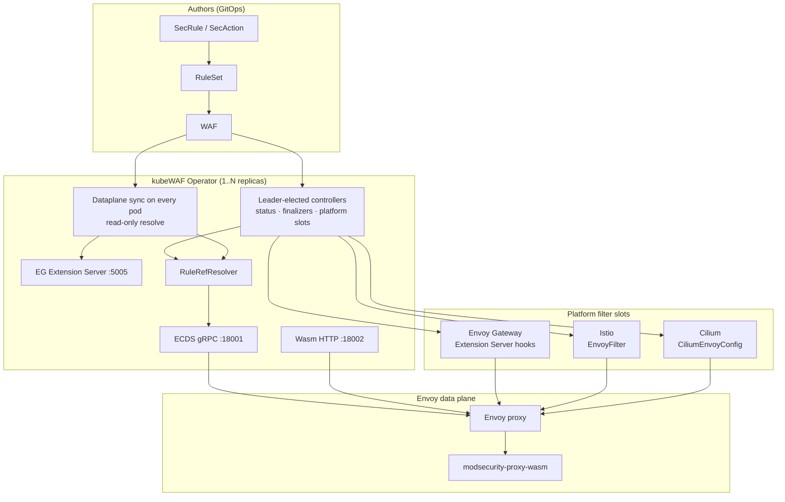
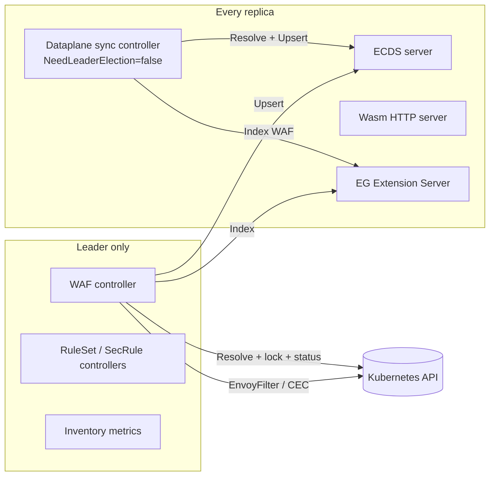
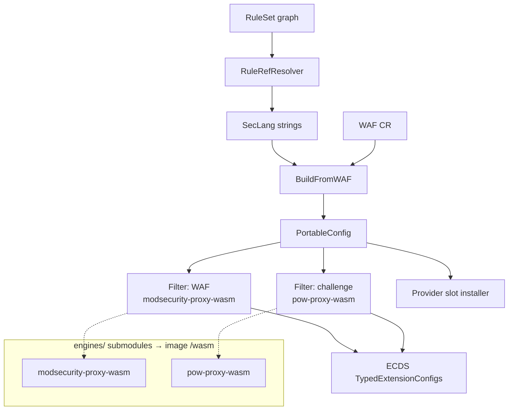
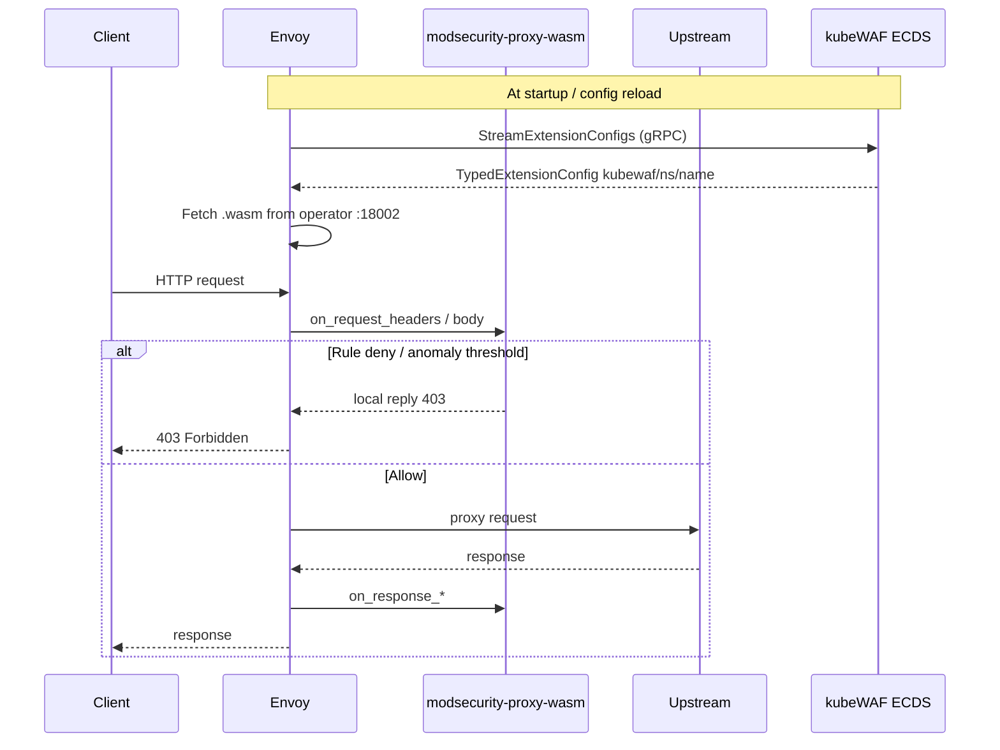
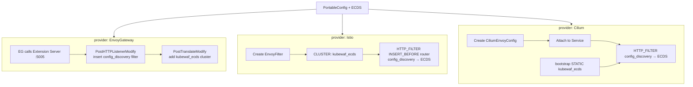
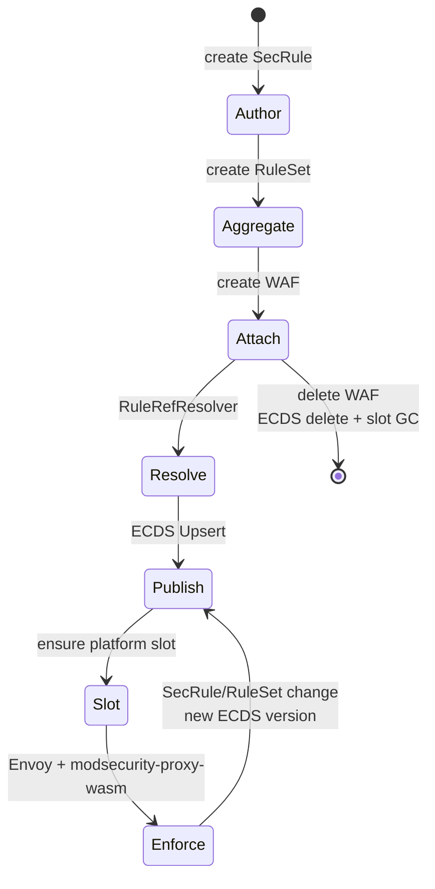
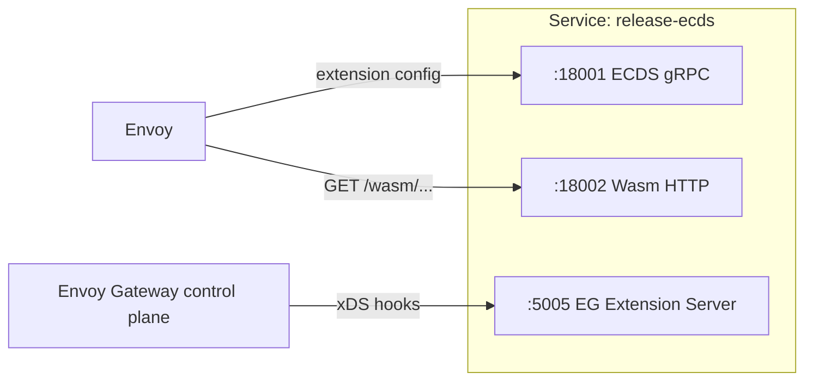

---

title: "Architecture"
description: "Control plane, data plane, ECDS, and high availability"
weight: 30
content_type: concept
aliases:
  - "/docs/concepts/architecture/"
  - "/docs/kubewaf/concepts/architecture/"
---
**kubeWAF** is a Kubernetes operator that turns structured security CRDs into live
WAF configuration on Envoy-based data planes. Evaluation runs in
**modsecurity-proxy-wasm**; you can optionally put **pow-proxy-wasm** (PoW challenge)
in front via [`spec.challenge`](/docs/users/challenge/).

Configuration is pushed over Envoy’s **Extension Config Discovery Service (ECDS)**;
each gateway product only receives a thin **filter slot**.

## Big picture



## Control plane vs data plane

| Plane | Responsibility |
|-------|----------------|
| **Kubernetes API** | Desired state: rules, sets, attachment (`WAF`) |
| **kubeWAF operator** | Resolve rules → SecLang → portable config; multi-module wasm serve; ECDS; provider slots |
| **Gateway control plane** | Routing, TLS, listeners (Envoy Gateway / Istio / Cilium) |
| **Envoy + Wasm engines** | Challenge (optional) then modsecurity-proxy-wasm evaluates traffic |

kubeWAF **does not** replace the gateway’s ADS (LDS/RDS/CDS). It only owns
**extension config** (ECDS) and installs a small filter that points at that ECDS
resource.

## Operator internals



### Why this split?

Envoy (and Envoy Gateway) load-balance against the operator **Service**. If only
the leader held ECDS config, non-leader pods would return empty snapshots and
requests would fail or bypass WAF randomly. Dataplane servers and the sync
controller therefore run on **every** pod; Kubernetes **writes** stay on the leader.

## Portable config artifact

After rule resolution, every path produces the same intermediate object — now with
an **ordered filter list** (optional Challenge, then WAF engine):



The ECDS resource type is always:

`type.googleapis.com/envoy.extensions.filters.http.wasm.v3.Wasm`

with modsecurity-proxy-wasm plugin JSON of the form
(see [`schemas/waf-plugin-config.json`](https://github.com/kubewaf-io/kubewaf/blob/main/schemas/waf-plugin-config.json)):

```json
{
  "mode": "kubewaf",
  "config_id": "kubewaf/shop/shop-waf",
  "allow_fallback": false,
  "default_directives": "default",
  "directives_map": {
    "default": [
      "Include @kubewaf-defaults",
      "SecRuleEngine On",
      "SecDebugLogLevel 1",
      "..."
    ]
  },
  "metric_labels": {
    "waf_namespace": "shop",
    "waf_name": "shop-waf",
    "engine": "modsecurity",
    "owner": "modsecurity-proxy-wasm",
    "team": "payments"
  },
  "metrics": { "enabled": true, "per_rule_id": true, "rule_tags": true },
  "block": { "message": "Forbidden", "blocked_header": "x-blocked" }
}
```

## End-to-end request path



## Multi-provider slots



| Provider | Slot resource | How filter is installed |
|----------|---------------|-------------------------|
| **EnvoyGateway** | (none owned by kubeWAF) | EG Extension Server hooks mutate xDS |
| **Istio** | `EnvoyFilter` | `config_discovery` → external ECDS |
| **Cilium** | `CiliumEnvoyConfig` | `config_discovery` → bootstrap-static ECDS |

See [Data plane (ECDS)](/docs/platform/dataplane-ecds/) for configuration details.

## Core CRDs

| CRD | Purpose | API |
|-----|---------|-----|
| `SecRule` | Individual security rule (structured YAML) | `v1beta1` |
| `SecAction` | Unconditional SecLang action | `v1beta1` |
| `SecRuleIDPool` | Cluster-scoped auto IDs when `metadata.id` is omitted | `v1beta1` |
| `PhraseList` / `IPList` | Bodies for `@pmFromFile` / `@ipMatchFromFile` | `v1beta1` |
| `RuleSet` | Named collection (selectors, recursion, `allowedRules`) | `v1beta1` |
| `WAF` | Attach RuleSets to a gateway provider + push ECDS | `v1beta1` |

## Data flow (lifecycle)



1. **Author** — `SecRule` / `SecAction` (or CRS converter).
2. **Aggregate** — `RuleSet` selects rules (names or labels).
3. **Attach** — `WAF` references RuleSets and a provider.
4. **Resolve** — flatten graph, enforce namespace policy, back-references (leader).
5. **Publish** — every pod updates its ECDS snapshot.
6. **Slot** — leader ensures EnvoyFilter / CEC / EG index.
7. **Enforce** — modsecurity-proxy-wasm evaluates traffic.

Rule content changes bump the **ECDS snapshot only**; platform slots are not rewritten unless provider or ECDS endpoint settings change.

## Operator ports and Service



| Port | Protocol | Consumers |
|------|----------|-----------|
| **18001** | gRPC ECDS | Envoy (`kubewaf_ecds` cluster) |
| **5005** | gRPC EG extension API | Envoy Gateway only |
| **18002** | HTTP | Envoy fetching the `.wasm` binary |

## Security model

- Rules are **namespaced**.
- `RuleSet.allowedRules` controls who may contribute rules (`Same` / `All` / `Selector`).
- Only `RuleSet`s attach to a `WAF` (not raw `SecRule`s).
- Platform teams own RuleSets + WAF attachment; app teams own SecRules in their namespace.
- Validating [admission webhooks](/docs/platform/webhooks/) reject invalid CRs at apply time (Helm default).
- Unresolved RuleSet or SecLang refs, or missing custom PhraseList/IPList (`phraseListPolicy: FailClosed`), skip a new ECDS publish. The last good snapshot stays.

## Status and conditions

```bash
kubectl get waf -o wide
kubectl describe waf shop-waf
```

| Field / condition | Meaning |
|-------------------|---------|
| `Ready` | ECDS published and slot ensured |
| `ReferencesResolved` | All RuleSet refs resolved |
| `status.provider` | `EnvoyGateway` / `Istio` / `Cilium` |
| `status.engine` | Active WAF engine (e.g. `ModSecurity`) |
| `status.challengeEnabled` | PoW filter installed |
| `status.ecdsResourceName` | e.g. `kubewaf/shop/shop-waf` |
| `status.ecdsVersion` | Snapshot generation counter |
| `status.slotKind` | `ExtensionServer` / `EnvoyFilter` / `CiliumEnvoyConfig` |

## Current limitations

- Cilium needs bootstrap-static `kubewaf_ecds` on `cilium-envoy` (CEC slot is always created).
- Envoy Gateway requires `extensionManager` configured to call kubeWAF.
- Cilium remesh adds STATIC `kubewaf_otel` + `stats_tags` only. Catalog OTLP and eval capture do not run on Cilium 1.19.

## Related projects

- [WAF engine (kubeWAF)](/docs/platform/engine/) · [modsecurity-proxy-wasm](/engines/modsecurity-proxy-wasm/)
- [PoW challenge (kubeWAF)](/docs/users/challenge/) · [pow-proxy-wasm](/engines/pow-proxy-wasm/)
- [Envoy Gateway](https://gateway.envoyproxy.io/)
- [Istio EnvoyFilter](https://istio.io/latest)
- [Cilium Envoy](https://docs.cilium.io/en/stable/network/servicemesh/envoy/)
- [OWASP CRS](https://coreruleset.org/)

## Next

- [Data plane (ECDS)](/docs/platform/dataplane-ecds/)
- [Envoy Gateway](/docs/platform/providers/envoy-gateway/) · [Istio](/docs/platform/providers/istio/) · [Cilium](/docs/platform/providers/cilium/)
