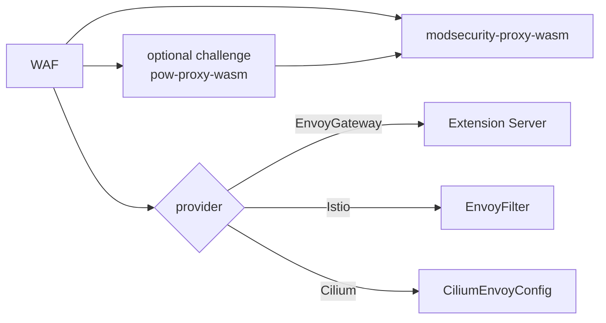

---

title: "Core Concepts"
description: "SecRule, PhraseList, IPList, RuleSet, WAF, and how they relate"
weight: 20
content_type: concept
aliases:
  - "/docs/concepts/core-concepts/"
  - "/docs/kubewaf/concepts/core-concepts/"
---
This page explains the fundamental building blocks of kubeWAF.

## SecRule

A `SecRule` is the atomic unit of protection. It describes a single security check using ModSecurity SecLang concepts:

- **Variables** (what to inspect)
- **Operator** (how to compare)
- **Actions** (what to do on match)
- **Metadata** (id, phase, message, tags, severity)

Example (simplified):

```yaml
spec:
  secLangRules:
  - metadata:
      id: 100100
      phase: "2"
    conditions:
    - collections:
      - name: ARGS
      operator: { name: rx, value: <script> }
    actions:
      disruptive: { disruptiveActionType: deny }
```

See the full [SecLang YAML structure reference](/docs/security/seclang-structure).

## PhraseList and IPList

Some operators need **external list files** rather than inline strings:

| Resource | SecLang operator | Content |
|----------|------------------|---------|
| **PhraseList** | `@pmFromFile` / `@pmf` | Phrase tokens |
| **IPList** | `@ipMatchFromFile` / `@ipMatchF` | IPs and CIDRs |

Both are namespaced CRs with a `fileName` (e.g. `team-scanners.data`) and either
inline `content` or a ConfigMap source. For ModSecurity, the operator always
injects resolved bodies into plugin `data_files`. Stock CRS `*.data` files stay
embedded; use these CRs for custom basenames.

Guide: [Phrase & IP lists](/docs/users/data-files/).  
Reference: [PhraseList](/docs/reference/crds/phraselist/), [IPList](/docs/reference/crds/iplist/).

## RuleSet

A `RuleSet` is a **named, reusable collection** of rules.

Instead of listing hundreds of individual rules on every policy attachment, you create a `RuleSet` once and reference it from `WAF`.

Key capabilities:

- Direct name references
- Label selector references (`matchLabels`)
- Cross-namespace references (subject to `allowedRules` policy)
- Recursive RuleSet references (RuleSet → RuleSet)

```yaml
spec:
  ruleRefs:
  - kind: SecRule
    selector:
      matchLabels:
        app: payment-waf
        version: v2
  allowedRules:
    from: Same          # or "All" or "Selector"
```

## WAF

`WAF` is the **primary way** to enforce rules on live traffic.

It:

1. Resolves `ruleRefs` into SecLang  
2. Runs **modsecurity-proxy-wasm** (optional **pow-proxy-wasm** challenge first)  
3. Publishes ECDS resources  
4. Installs a **provider-specific slot** so Envoy loads those configs  



Important fields:

| Field | Purpose |
|-------|---------|
| `targetRef` / `targetRefs` | Gateway API targets (Gateway, HTTPRoute, …). Nested `parentRefs` also resolves. |
| `provider.type` | `EnvoyGateway` · `Istio` · `Cilium` · `Auto` |
| `status.engine` | `ModSecurity` |
| `challenge` | Optional PoW filter before WAF |
| `ruleRefs` | RuleSets only |
| `crsEnable` / `crs` | OWASP CRS + declarative tuning |
| `phraseListPolicy` | Missing custom PhraseList/IPList: `FailClosed` or `IgnoreUnknown` |

See [WAF CRD](/docs/reference/crds/waf), [engine](/docs/platform/engine), [challenge](/docs/users/challenge/), [Data plane](/docs/platform/dataplane-ecds/).

## Rule reference resolution

When you reference a `RuleSet`, the resolver:

1. Recursively expands nested RuleSets  
2. Collects matching `SecRule` / `SecAction` resources  
3. Validates namespace policies (`allowedRules`)  
4. Creates back-references (leader path)  
5. Sets `ReferencesResolved`

Non-leader pods use a **read-only** resolve path to keep ECDS warm without fighting over finalizers.

Unresolved RuleSet or SecLang refs do **not** replace a last-good ECDS snapshot.

## Phases

Like classic ModSecurity, rules run in phases:

- **Phase 1** — Request headers (very early)
- **Phase 2** — Request body
- **Phase 3** — Response headers
- **Phase 4** — Response body
- **Phase 5** — Logging

Most application-level rules live in phase 2.

## Portable config

Authors never write Envoy JSON. The operator builds a **PortableConfig** with an ordered
`Filters` list (optional challenge, then WAF) shared by every provider. That is what
ECDS serves and what slots point at.

## Engines (`engines/` submodules)

| Capability | kubeWAF docs | Engine project |
|------------|--------------|----------------|
| WAF evaluation | [WAF engine](/docs/platform/engine/) | [modsecurity-proxy-wasm](/engines/modsecurity-proxy-wasm/) |
| PoW challenge | [Challenge](/docs/users/challenge/) | [pow-proxy-wasm](/engines/pow-proxy-wasm/) |

## Next

- [Architecture](architecture/)  
- [Writing rules](/docs/security/writing-rules/)  
- Providers: [Envoy Gateway](/docs/platform/providers/envoy-gateway/) · [Istio](/docs/platform/providers/istio/) · [Cilium](/docs/platform/providers/cilium/)
