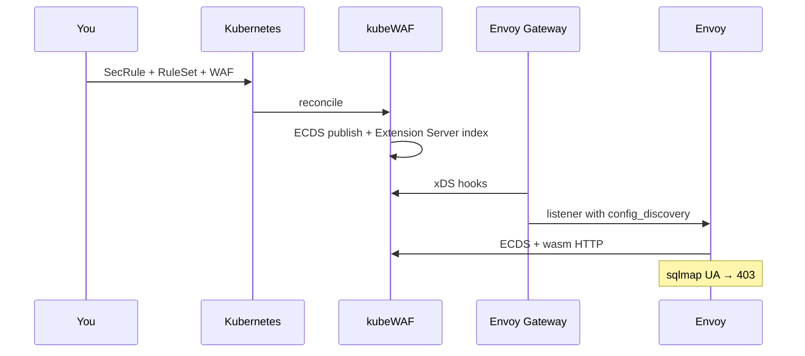

---

title: "Quick Start"
description: "Deploy a protected service end to end with kubeWAF"
weight: 40
content_type: task
aliases:
  - "/docs/setup/quickstart/"
  - "/docs/getting-started/quickstart/"
  - "/docs/kubewaf/getting-started/quickstart/"
---
Get a working WAF-protected HTTP service in under 10 minutes.

{}
This walkthrough targets **Envoy Gateway** on **beta**.  
OCI chart tag is **`v0.1.0-beta.1`** (leading `v`).  
See [Beta status](/docs/get-started/beta/) for limitations.
{}

## Assumptions

- A Kubernetes cluster, `kubectl`, and **Helm 3.8+**
- You use **Envoy Gateway** for this walkthrough (Istio/Cilium: [provider guides](/docs/platform/providers/))

## 1. Install Envoy Gateway (if not already present)

```bash
helm install eg oci://docker.io/envoyproxy/gateway-helm \
  --version v1.8.0 \
  --namespace envoy-gateway-system \
  --create-namespace
```

Wait for it to be ready:

```bash
kubectl wait --timeout=5m -n envoy-gateway-system deployment/envoy-gateway --for=condition=Available
```

## 2. Install the kubeWAF operator

Published OCI tags match the git tag, including the **`v` prefix**:

```bash
helm install kubewaf oci://ghcr.io/kubewaf-io/charts/kubewaf \
  --namespace kubewaf-system \
  --create-namespace \
  --version v0.1.0-beta.1
```

Wait for the operator:

```bash
kubectl wait --timeout=5m -n kubewaf-system \
  deployment -l app.kubernetes.io/instance=kubewaf --for=condition=Available
```

Wasm is served from the operator image (`/wasm`). Full values: [Installation](/docs/platform/installation/).

Point Envoy Gateway at kubeWAF with an **`EnvoyGateway`** document (ConfigMap).
This is what injects the Wasm filter when you apply a `WAF`:

```yaml
# envoy-gateway-kubewaf.yaml
apiVersion: v1
kind: ConfigMap
metadata:
  name: envoy-gateway-config
  namespace: envoy-gateway-system
data:
  envoy-gateway.yaml: |
    apiVersion: gateway.envoyproxy.io/v1alpha1
    kind: EnvoyGateway
    gateway:
      controllerName: gateway.envoyproxy.io/gatewayclass-controller
    provider:
      type: Kubernetes
    extensionManager:
      policyResources:
        - group: waf.kubewaf.io
          version: v1beta1
          kind: WAF
      hooks:
        xdsTranslator:
          post:
            - HTTPListener
            - Translation
          translation:
            cluster:
              includeAll: true
            secret:
              includeAll: true
      service:
        fqdn:
          hostname: kubewaf-ecds.kubewaf-system.svc.cluster.local
          port: 5005
---
apiVersion: rbac.authorization.k8s.io/v1
kind: ClusterRole
metadata:
  name: kubewaf-envoy-gateway-waf-reader
rules:
  - apiGroups: [waf.kubewaf.io]
    resources: [wafs, wafs/status]
    verbs: [get, list, watch, update, patch]
---
apiVersion: rbac.authorization.k8s.io/v1
kind: ClusterRoleBinding
metadata:
  name: kubewaf-envoy-gateway-waf-reader
roleRef:
  apiGroup: rbac.authorization.k8s.io
  kind: ClusterRole
  name: kubewaf-envoy-gateway-waf-reader
subjects:
  - kind: ServiceAccount
    name: envoy-gateway
    namespace: envoy-gateway-system
```

```bash
kubectl apply -f envoy-gateway-kubewaf.yaml
kubectl -n envoy-gateway-system rollout restart deployment/envoy-gateway
```

Also add the static `kubewaf_ecds` bootstrap on the `EnvoyProxy` used by
GatewayClass `eg`. See [Envoy Gateway](/docs/platform/providers/envoy-gateway/#bootstrap-static-kubewaf_ecds-cluster-required).

## 3. Create a simple Backend Application

We'll use a basic `httpbin` pod as our protected backend.

```yaml
# backend.yaml
apiVersion: v1
kind: Namespace
metadata:
  name: demo
---
apiVersion: v1
kind: Pod
metadata:
  name: httpbin
  namespace: demo
  labels:
    app: httpbin
spec:
  containers:
  - name: httpbin
    image: kennethreitz/httpbin
    ports:
    - containerPort: 80
---
apiVersion: v1
kind: Service
metadata:
  name: httpbin
  namespace: demo
spec:
  selector:
    app: httpbin
  ports:
  - port: 80
    targetPort: 80
```

Apply it:

```bash
kubectl apply -f backend.yaml
```

## 4. Create a GatewayClass, Gateway, and HTTPRoute

Helm does not create GatewayClass `eg`. Apply it with the Gateway:

```yaml
# gateway.yaml
apiVersion: gateway.networking.k8s.io/v1
kind: GatewayClass
metadata:
  name: eg
spec:
  controllerName: gateway.envoyproxy.io/gatewayclass-controller
---
apiVersion: gateway.networking.k8s.io/v1
kind: Gateway
metadata:
  name: demo-gateway
  namespace: demo
spec:
  gatewayClassName: eg
  listeners:
  - name: http
    port: 80
    protocol: HTTP
    allowedRoutes:
      namespaces:
        from: Same
---
apiVersion: gateway.networking.k8s.io/v1
kind: HTTPRoute
metadata:
  name: httpbin
  namespace: demo
spec:
  parentRefs:
  - name: demo-gateway
  hostnames:
  - "demo.local"
  rules:
  - matches:
    - path:
        type: PathPrefix
        value: /
    backendRefs:
    - name: httpbin
      port: 80
```

Apply:

```bash
kubectl apply -f gateway.yaml
```

## 5. Define a Simple Security Rule

Block a known scanner `User-Agent`.

```yaml
# rule-block-bad-ua.yaml
apiVersion: seclang.kubewaf.io/v1beta1
kind: SecRule
metadata:
  name: block-bad-user-agent
  namespace: demo
  labels:
    app: demo-waf
spec:
  metadata:
    id: 100001
    phase: "1"
    message: "Blocked malicious User-Agent"
    severity: "ERROR"
    tags:
      - "attack-generic"
  match:
  - collections:
    - name: REQUEST_HEADERS
      arguments: [User-Agent]
    operator:
      name: rx
      value: (?:nikto|sqlmap|nessus|openvas)
  actions:
    disruptive:
      disruptiveActionType: deny
    data:
    - dataActionType: status
      value: "403"
    non-disruptive:
    - nonDisruptiveActionType: log
```

Apply the rule:

```bash
kubectl apply -f rule-block-bad-ua.yaml
```

## 6. Group the Rule into a RuleSet

```yaml
# ruleset-demo.yaml
apiVersion: waf.kubewaf.io/v1beta1
kind: RuleSet
metadata:
  name: demo-rules
  namespace: demo
spec:
  ruleRefs:
  - kind: SecRule
    group: seclang.kubewaf.io
    version: v1beta1
    selector:
      matchLabels:
        app: demo-waf
```

Apply:

```bash
kubectl apply -f ruleset-demo.yaml
```

## 7. Attach WAF Policy to Your Gateway

```yaml
# waf-policy.yaml
apiVersion: waf.kubewaf.io/v1beta1
kind: WAF
metadata:
  name: demo-waf
  namespace: demo
spec:
  mode: Blocking
  provider:
    type: EnvoyGateway
  targetRef:
    group: gateway.networking.k8s.io
    kind: Gateway
    name: demo-gateway

  ruleRefs:
  - kind: RuleSet
    name: demo-rules
    namespace: demo
    group: waf.kubewaf.io
    version: v1beta1

  crsEnable: false
  logLevel: 1
```

Apply:

```bash
kubectl apply -f waf-policy.yaml
kubectl get waf demo-waf -n demo -o yaml   # Ready, ecdsResourceName, slotKind=ExtensionServer
```

## 8. Test the Protection

```bash
# Find the Envoy proxy Service created by Envoy Gateway
kubectl get svc -n envoy-gateway-system
```

Send a normal request:

```bash
curl -H "Host: demo.local" http://<envoy-svc-or-port-forward>/get
```

Blocked User-Agent:

```bash
curl -H "Host: demo.local" -H "User-Agent: sqlmap/1.0" http://<envoy>/get -I
```

You should receive **403 Forbidden** from the WAF (modsecurity-proxy-wasm).

## 9. Attach OWASP CRS (optional, Path B)

The default operator image is path-b wasm (no embedded CRS confs). After
**platform** installs `kubewaf-crs`
([Installation](/docs/platform/installation/#crs-as-kubernetes-objects-optional)),
attach a default-on profile:

```yaml
spec:
  crsEnable: false
  crs:
    paranoiaLevel: 1
  ruleRefs:
  - kind: RuleSet
    name: demo-rules
  - kind: RuleSet
    name: ruleset-api
```

`crsEnable: true` (Path A) needs the full-catalog wasm (`*-full` / `make wasm-build-full`). See [OWASP CRS](/docs/security/using-crs/).

## What just happened?



1. Structured `SecRule` in Git-friendly YAML  
2. Grouped into a `RuleSet`  
3. `WAF` attached to the Gateway  
4. Config pushed over **ECDS**; EG Extension Server installed the filter stub  
5. modsecurity-proxy-wasm blocks scanners before the app  

## Next steps

- [Architecture diagrams](/docs/get-started/architecture/)  
- [Writing rules](/docs/security/writing-rules/) · [CRS](/docs/security/using-crs/)  
- Other providers: [Istio](/docs/platform/providers/istio/) · [Cilium](/docs/platform/providers/cilium/)  
- [WAF CRD reference](/docs/reference/crds/waf/)
