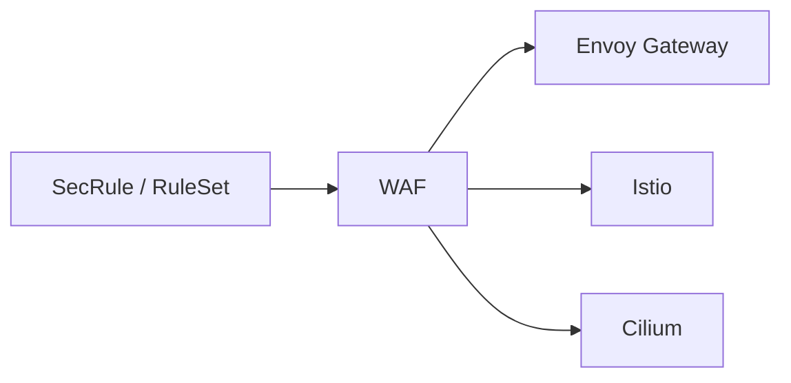

---

title: "Why kubeWAF?"
description: "Why a Kubernetes-native WAF with structured CRDs and multi-gateway data plane"
weight: 10
content_type: concept
aliases:
  - "/docs/concepts/why-kubewaf/"
  - "/docs/kubewaf/concepts/why-kubewaf/"
---
A natural question is: *why not hand-write Envoy Wasm config / EnvoyFilter /
CiliumEnvoyConfig?* kubeWAF still produces low-level Envoy config — but that is
the wrong abstraction for most engineers.

## Structured rules with separation of duties

When developers edit raw Envoy extension config, the entire WAF policy lives as
one opaque blob: SecLang strings escaped inside Wasm JSON, mixed with image
URLs, filter order, and route attachment.

**Unreviewable.** Rules buried in JSON strings are hard to diff and easy to break.

**No organizational boundary.** Whoever can edit the policy owns every rule and
every route.

kubeWAF makes rules **structured, namespaced CRDs**:

| Who | Owns |
|-----|------|
| App teams | `SecRule` in their namespace |
| Platform | `RuleSet`, `allowedRules`, `WAF` attachment |

Only `RuleSet`s attach to a `WAF`. Structure and access control reinforce each other.

## One rule model, many gateways

The same RuleSets push over **ECDS** to Envoy Gateway, Istio, or Cilium. Only
the thin **slot** differs. The WAF engine is **modsecurity-proxy-wasm** (with
optional **pow-proxy-wasm** challenge). See [Architecture](architecture).

## Hot rule updates without rewriting platform YAML

Rule changes publish a new ECDS snapshot. Platform slot objects are **not**
rewritten on every SecRule edit — so GitOps noise stays low and Envoy reloads
only extension config.

## Operator-owned defaults

kubeWAF injects correct CRS ordering, hosts **modsecurity-proxy-wasm** (and
optional challenge wasm), and wires providers so app teams never hand-roll
bootstrap footguns (“403 everything”, missing paranoia thresholds, wrong
directive order).

## Related

- [Architecture](architecture/)
- [Data plane (ECDS)](/docs/platform/dataplane-ecds/)
- [Challenge](/docs/users/challenge/) · [Engine](/docs/platform/engine/)
