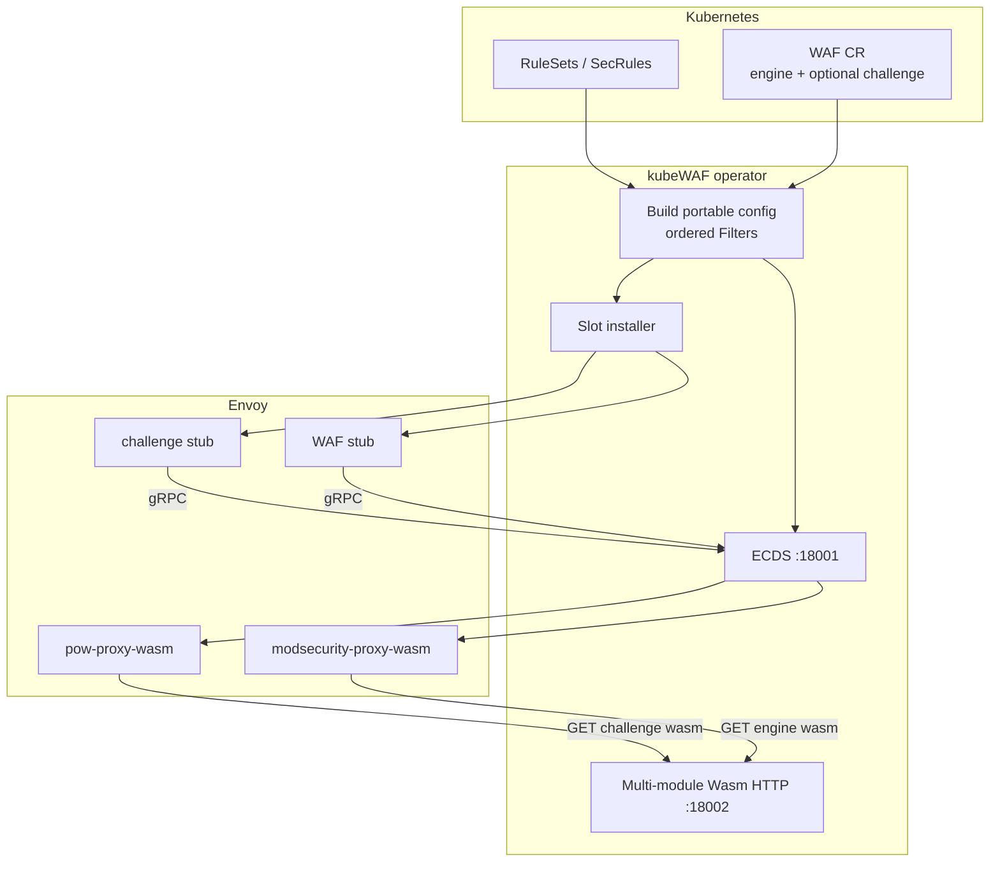
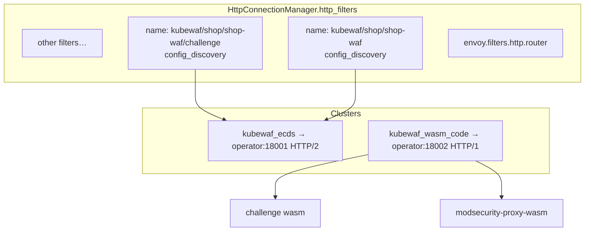
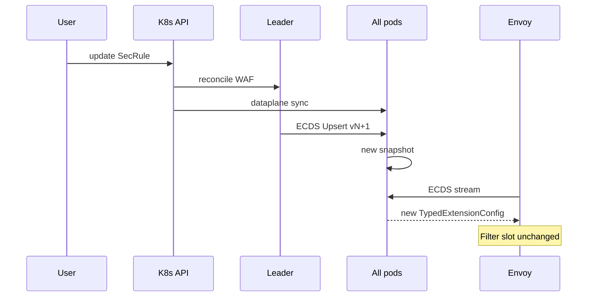
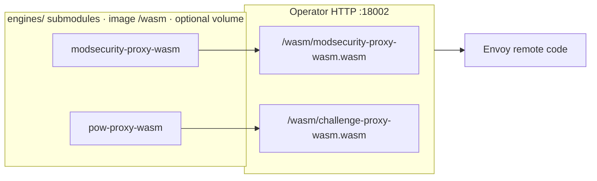
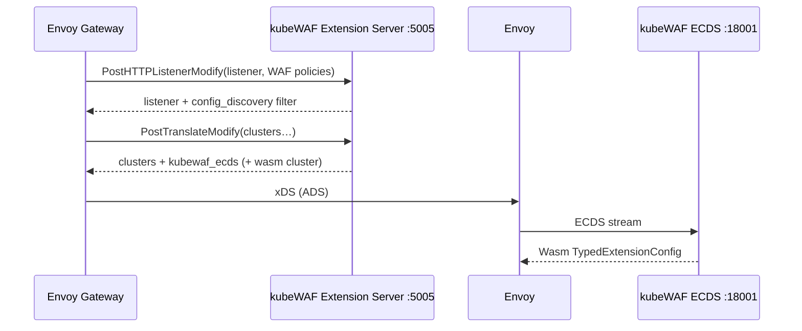
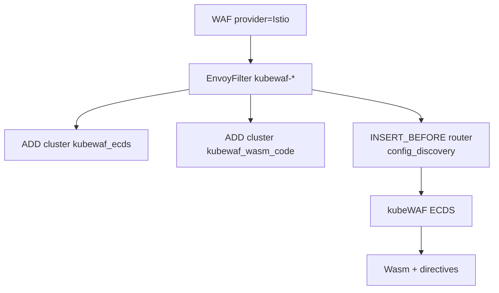
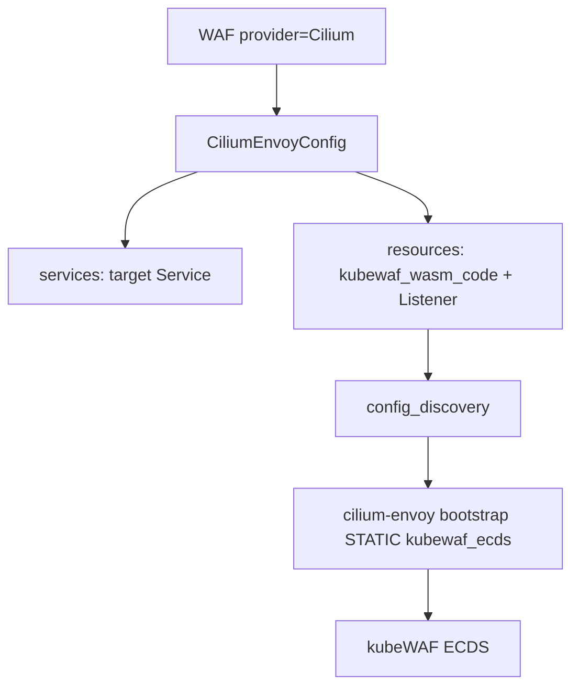
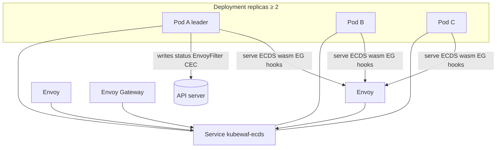

---

title: "Data plane (ECDS)"
description: "How kubeWAF pushes config over ECDS to Envoy-based gateways"
weight: 30
content_type: task
aliases:
  - "/docs/tasks/dataplane-ecds/"
  - "/docs/operator/dataplane-ecds/"
  - "/docs/kubewaf/operator/dataplane-ecds/"
---
This guide is the **authoritative description** of how kubeWAF pushes config into
Envoy and how Envoy Gateway, Istio, and Cilium attach the filter.

## Overview



**Key idea:** rule updates are pure ECDS publishes. Platform-specific resources
only install **stubs**. Engines and challenge modules are separate wasm binaries
served by the operator (see [WAF engine](/docs/platform/engine/) and [challenge](/docs/users/challenge/)).

Unresolved RuleSet or SecLang refs skip the new ECDS upsert. The last good
snapshot stays on Envoy. Missing custom PhraseList/IPList files follow
`spec.phraseListPolicy` (`FailClosed` by default).

## Architecture deep dive

### What Envoy sees



### ECDS resource naming

| Item | Value |
|------|--------|
| WAF filter name | `kubewaf/<namespace>/<waf-name>` |
| Challenge filter name | `kubewaf/<namespace>/<waf-name>/challenge` |
| Example | `kubewaf/shop/shop-waf` |
| Cluster for ECDS | `kubewaf_ecds` |
| Cluster for wasm fetch | `kubewaf_wasm_code` (Cilium ECDS RemoteDataSource uses the CEC-prefixed name `<ns>/kubewaf-<waf>/kubewaf_wasm_code`) |

### Rule update vs slot update



## Wasm binary delivery (multi-module)

Envoy must **HTTP-fetch** each `.wasm` (OCI alone is not used on pure ECDS).



### Operator hosts modules

Wasm binaries live on the operator at:

| Module | Path |
|--------|------|
| ModSecurity | `/wasm/modsecurity-proxy-wasm.wasm` |
| Challenge | `/wasm/challenge-proxy-wasm.wasm` |

Ko images also resolve them under `KO_DATA_PATH/wasm`. From an operator checkout (`engines/` submodules):

```bash
make wasm-build   # → dist/wasm/*.wasm
```

Default Envoy URLs (operator Service):

```text
http://<release>-ecds.<ns>.svc:18002/wasm/modsecurity-proxy-wasm.wasm
http://<release>-ecds.<ns>.svc:18002/wasm/challenge-proxy-wasm.wasm
```

Operator guides: [WAF engine](/docs/platform/engine/) · [challenge](/docs/users/challenge/).

## Provider: Envoy Gateway



### Enable Extension Server on Envoy Gateway

```yaml
apiVersion: gateway.envoyproxy.io/v1alpha1
kind: EnvoyGateway
provider:
  type: Kubernetes
gateway:
  controllerName: gateway.envoyproxy.io/gatewayclass-controller
extensionManager:
  policyResources:
    - group: waf.kubewaf.io
      version: v1beta1
      kind: WAF
  hooks:
    xdsTranslator:
      post:
        - HTTPListener
        - Translation
  service:
    fqdn:
      hostname: kubewaf-ecds.kubewaf-system.svc.cluster.local
      port: 5005
```

Restart Envoy Gateway after changing this config.

### Example WAF

```yaml
apiVersion: waf.kubewaf.io/v1beta1
kind: WAF
metadata:
  name: shop-waf
  namespace: shop
spec:
  provider:
    type: EnvoyGateway
  targetRef:
    group: gateway.networking.k8s.io
    kind: Gateway
    name: external
  crsEnable: false
  ruleRefs:
    - kind: RuleSet
      name: shop-rules
```

Full guide: [Envoy Gateway Integration](/docs/platform/providers/envoy-gateway/).

## Provider: Istio



No Istio control-plane flag is required. kubeWAF creates the `EnvoyFilter`.

```yaml
spec:
  provider:
    type: Istio
    istio:
      workloadSelector:
        istio: ingressgateway
      context: GATEWAY
```

Full guide: [Istio Integration](/docs/platform/providers/istio/).

## Provider: Cilium



```yaml
spec:
  provider:
    type: Cilium
    cilium:
      serviceName: shop-frontend
      serviceNamespace: shop
```

{}
`kubewaf_ecds` must be a **STATIC** cluster on the `cilium-envoy` bootstrap
(ClusterIP `:18001`). CEC `config_discovery` is the same stub as EG/Istio.
See [Cilium Integration](/docs/platform/providers/cilium/).
{}


## Multi-replica / HA



| Component | Runs on | Leader election |
|-----------|---------|-----------------|
| ECDS gRPC | every pod | no |
| Wasm HTTP | every pod | no |
| EG Extension Server | every pod | no |
| Dataplane sync controller | every pod | no |
| WAF controller (status, slots, finalizers) | leader | yes |
| Inventory metrics | leader | yes |

Helm defaults:

```yaml
replicaCount: 2
leaderElection:
  enabled: true
podDisruptionBudget:
  enabled: true
  minAvailable: 1
```

## Status fields

```bash
kubectl get waf shop-waf -o yaml
```

| Field | Meaning |
|-------|---------|
| `status.provider` | Resolved provider |
| `status.engine` | WAF engine (e.g. `ModSecurity`) |
| `status.challengeEnabled` | PoW filter installed |
| `status.ecdsResourceName` | Primary WAF ECDS name |
| `status.ecdsVersion` | Snapshot counter |
| `status.slotKind` | `ExtensionServer` / `EnvoyFilter` / `CiliumEnvoyConfig` |
| `status.slotName` | Platform object name (if any) |
| `status.conditions[Ready]` | Overall health |

## Operator flags (summary)

| Flag | Default | Purpose |
|------|---------|---------|
| `--leader-elect` | `true` | Multi-replica safety for writes |
| `--ecds-bind-address` | `:18001` | ECDS listen |
| `--extension-server-bind-address` | `:5005` | EG hooks |
| `--wasm-serve-bind-address` | `:18002` | Multi-module wasm HTTP |
| `--ecds-service-host` | chart FQDN | DNS name for Envoy clusters |

## E2E

Provider tests live under `test/e2e/`. See [test/e2e/README.md](https://github.com/kubewaf-io/kubewaf/blob/main/test/e2e/README.md).

```bash
make test-e2e-envoy-gateway
make test-e2e-istio
make test-e2e-cilium
```

## Related guides

- [WAF engine](/docs/platform/engine/)
- [Proof-of-Work challenge](/docs/users/challenge/)
- [Challenge Proxy-WASM (PoW)](/engines/pow-proxy-wasm/)
- [Architecture](/docs/get-started/architecture/)
- [Envoy Gateway](/docs/platform/providers/envoy-gateway/)
- [Istio](/docs/platform/providers/istio/)
- [Cilium](/docs/platform/providers/cilium/)
- [Observability](/docs/platform/observability/)
