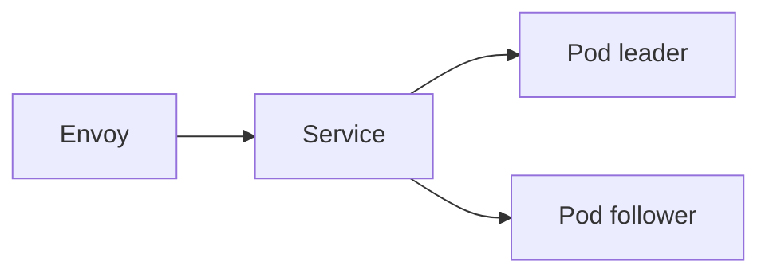

---

title: "Installation"
description: "Install the kubeWAF operator on a Kubernetes cluster with Helm"
weight: 10
content_type: task
aliases:
  - "/docs/setup/installation/"
  - "/docs/getting-started/installation/"
  - "/docs/kubewaf/getting-started/installation/"
---
This guide covers installing the kubeWAF operator on a Kubernetes cluster.

{}
Current chart/app version is **`0.1.0-beta.1`**. Read
[Beta status and limitations](/docs/get-started/beta/) before production use.
Prefer **Envoy Gateway** for first installs.
{}

## Prerequisites

- Kubernetes **1.25+** (use **1.28+** if you also install `kubewaf-crs`)
- `kubectl` and **Helm 3.8+**
- A data plane you will protect:
  - **Envoy Gateway** (recommended starting point), and/or  
  - **Istio**, and/or  
  - **Cilium** (CEC `config_discovery` + bootstrap-static `kubewaf_ecds`)

## Recommended: Helm

Published chart (OCI). The tag is the git tag, **including the `v` prefix**:

```bash
helm install kubewaf oci://ghcr.io/kubewaf-io/charts/kubewaf \
  --namespace kubewaf-system \
  --create-namespace \
  --version v0.1.0-beta.1
```

From an operator checkout:

```bash
git clone --recurse-submodules https://github.com/kubewaf-io/kubewaf.git
cd kubewaf
helm install kubewaf ./charts/kubewaf \
  --namespace kubewaf-system \
  --create-namespace
```

{}
Envoy fetches Wasm over HTTP from the operator. Prefer binaries **baked into the
operator image** (`/wasm`, also `KO_DATA_PATH/wasm`) or a volume mount under `/wasm`.
Operator checkout: `git submodule update --init --recursive` then `make wasm-build` → `dist/wasm/`.
See [WAF engine](/docs/platform/engine/), [challenge](/docs/users/challenge/), and
[Data plane](/docs/platform/dataplane-ecds/).
{}

Validating **admission webhooks** are enabled by default (`webhooks.enabled=true`).
See [Admission webhooks](/docs/platform/webhooks/).


### Verify

```bash
kubectl get pods -n kubewaf-system
kubectl get svc -n kubewaf-system
kubectl get crd | grep -E 'kubewaf|seclang'
```

Pods should be Ready (default **2 replicas**). Service should expose:

| Port | Name | Purpose |
|------|------|---------|
| 18001 | ecds | ECDS gRPC |
| 5005 | extension | Envoy Gateway Extension Server |
| 18002 | wasm | Multi-module `.wasm` HTTP |

CRDs:

- `secrules.seclang.kubewaf.io`
- `secactions.seclang.kubewaf.io`
- `secruleidpools.seclang.kubewaf.io` (cluster-scoped; operator creates `cluster`)
- `phraselists.seclang.kubewaf.io`
- `iplists.seclang.kubewaf.io`
- `rulesets.waf.kubewaf.io`
- `wafs.waf.kubewaf.io`

### Envoy Gateway only: enable Extension Server

After install, configure Envoy Gateway to call kubeWAF on port **5005**.
See [Envoy Gateway guide](/docs/platform/providers/envoy-gateway/#configure-envoy-gateway-extension-server).

## CRS as Kubernetes objects (optional)

The **`kubewaf-crs`** chart installs converted OWASP CRS `SecRule`s, stock
`PhraseList`s, and profile `RuleSet`s. Install it **after** the operator (it
needs the CRDs). Security teams then attach and tune those RuleSets —
[OWASP CRS](/docs/security/using-crs/).

```bash
helm install kubewaf-crs oci://ghcr.io/kubewaf-io/charts/kubewaf-crs \
  --namespace demo \
  --create-namespace \
  --version v0.1.0-beta.1
```

From an operator checkout: `helm install kubewaf-crs ./charts/kubewaf-crs -n demo --create-namespace`.

**On by default:** `crs-core`, `ruleset-api`, `ruleset-backend` (plus extras).
`php`, `java`, `golang`, `dotnet`, and `frontend` are off until you enable them:

```bash
helm upgrade kubewaf-crs oci://ghcr.io/kubewaf-io/charts/kubewaf-crs \
  --namespace demo --version v0.1.0-beta.1 \
  --set profiles.php.enabled=true
```

## Helm values overview

```yaml
replicaCount: 2

leaderElection:
  enabled: true

podDisruptionBudget:
  enabled: true
  minAvailable: 1

dataplane:
  ecds:
    port: 18001
  extensionServer:
    port: 5005
  wasmServe:
    port: 18002
  # Wasm from image /wasm (optional dataplane.wasmVolume)

image:
  registry: ghcr.io
  repository: kubewaf-io/kubewaf
  # defaults to chart appVersion (0.1.0-beta.1)
  tag: ""

args:
  logLevel: 4

webhooks:
  enabled: true
  failurePolicy: Fail

# Off by default. See Observability (metrics, capture, probes).
# subresourceApi.enabled: false
# observability.managed.enabled: false
```

Full reference: [charts/kubewaf/values.yaml](https://github.com/kubewaf-io/kubewaf/blob/main/charts/kubewaf/values.yaml).

## HA notes



- Every pod serves ECDS + wasm + EG hooks  
- Leader writes status and platform slots  
- See [Architecture · Multi-replica](/docs/get-started/architecture#operator-internals)

## Alternative: kustomize

```bash
kubectl apply -k https://github.com/kubewaf-io/kubewaf/config/crd
kubectl apply -k https://github.com/kubewaf-io/kubewaf/config/default
```

You must expose dataplane ports and pass wasm flags yourself; Helm is preferred.

## Upgrading

```bash
helm upgrade kubewaf oci://ghcr.io/kubewaf-io/charts/kubewaf \
  -n kubewaf-system \
  --version v0.1.0-beta.1
```

From an operator checkout: `helm upgrade kubewaf ./charts/kubewaf -n kubewaf-system`.

Re-apply `WAF` CRs if the chart upgrade changes webhook certs or ECDS Service
DNS. Unused `EnvoyExtensionPolicy` objects are not read — delete them if present.

## Uninstalling

```bash
helm uninstall kubewaf -n kubewaf-system
# Optionally: kubectl delete crd …  (if you manage CRD lifecycle separately)
```

## Next steps

1. [Quick start](/docs/get-started/quickstart/)  
2. [Data plane setup](/docs/platform/dataplane-ecds/)  
3. Provider guide: [Envoy Gateway](/docs/platform/providers/envoy-gateway/) · [Istio](/docs/platform/providers/istio) · [Cilium](/docs/platform/providers/cilium)
