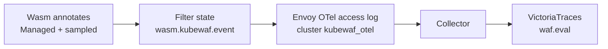

A **capture** is one WAF evaluation of one HTTP request — not a full request
dump and not Envoy APM tracing. Qualifying evals become a `waf.eval` span.

Allowed requests with **no** rule match are never captured.

## Path



1. Wasm writes rollup JSON to filter state `kubewaf.event` and flag
   `kubewaf.export=1` (Envoy stores `wasm.kubewaf.event` / `wasm.kubewaf.export`).
2. A second HCM OpenTelemetry access logger posts that body to `kubewaf_otel`
   (`:4317` gRPC). Platform access logs are left in place.
3. With `profile=full` and VictoriaTraces, the Collector turns the log record
   into one `waf.eval` span and writes VictoriaTraces. Each eval gets a unique
   `spanId`. `traceId` is new unless the request already carries W3C
   `traceparent` (that `traceId` is reused). OTLP logs are transport only —
   there is no log product.

On Envoy 1.38 the access logger is unfiltered (dynamic metadata is not writable
from Wasm; a CEL `filter_state` gate is rejected). The Collector keeps event
JSON, stamps span times, and drops the rest.

`proxy_log` JSON stays for DIY and go-ftw. Do not scrape Envoy logs for the
request list.

## When a span is emitted

Requires `spec.telemetry.mode: Managed` and traces enabled (explicit, or Helm
`full` default).

| Evaluation | Emitted? |
|------------|----------|
| Disruptive interrupt (`deny` / `drop` / `redirect`) | Sampled at `sampleDisruptive` (default `1.0`) |
| Non-disruptive `rule_match` only | Sampled at `sampleRate` (default `0.25`) |
| `DetectionOnly` (no interrupt executed) | Match-only spans at `sampleRate` |
| Allowed, no match | Never |
| `mode: None` or traces disabled | Never |

One span per qualifying request. Up to **16** match events
(`waf.rule_match` / `waf.tx_interrupt`); if truncated, the interrupting rule
is kept.

## Enable

Managed **full** plane (metrics + traces). On an existing release:

```bash
helm upgrade kubewaf oci://ghcr.io/kubewaf-io/charts/kubewaf \
  --namespace kubewaf-system \
  --version v0.1.0-beta.1 \
  --reuse-values \
  --set observability.managed.enabled=true \
  --set observability.managed.profile=full \
  --set observability.managed.victoriaMetrics.enabled=true \
  --set observability.managed.victoriaTraces.enabled=true
```

Merge the bootstrap as on
[Observability](/docs/platform/observability/#enable-the-managed-plane), then
set `observability.managed.injectConfigured=true`.

Query API (no Test Server). `probes.enabled` defaults true — this `--set`
turns probes **off** if they were already on:

```bash
helm upgrade kubewaf oci://ghcr.io/kubewaf-io/charts/kubewaf \
  --namespace kubewaf-system \
  --version v0.1.0-beta.1 \
  --reuse-values \
  --set subresourceApi.enabled=true \
  --set subresourceApi.probes.enabled=false
```

Bind ClusterRole `<release>-query`. Default `observability.managed.networkPolicy`
opens Collector `:4317` (no peer list) and restricts VM `:8428` / VT `:10428`
to collector, subresource-api, and operator pods. Cilium query-backend policy
is opt-in (`ciliumNetworkPolicy.enabled`).

```yaml
apiVersion: waf.kubewaf.io/v1beta1
kind: WAF
metadata:
  name: shop-waf
spec:
  targetRef:
    group: gateway.networking.k8s.io
    kind: Gateway
    name: shop-gw
  ruleRefs:
    - kind: RuleSet
      name: shop-rules
  telemetry:
    mode: Managed
    traces:
      enabled: true
      sampleRate: "0.25"
      sampleDisruptive: "1.0"
      redact: true
      includeMatchData: false
```

Rates are strings matching `^(0(\.[0-9]+)?|1(\.0+)?)$`. When the CR omits a
field, Helm `observability.managed.traces` supplies `sampleNonDisruptive` →
`sampleRate`, `sampleDisruptive`, `redact`, and `includeMatchDataDefault` →
`includeMatchData`.

## Span shape

| | Value |
|--|--------|
| Name / kind | `waf.eval` / INTERNAL |
| Resource | `service.name=kubewaf`, `waf.namespace`, `waf.name`, `waf.engine`, `waf.config_id` |
| Status | Error if interrupted, else Unset |
| Attributes | `http.request.method`, `url.path`, `http.response.status_code`, `waf.interrupted`, `waf.action`, `waf.phase`, `waf.request_id` |
| Parent | W3C `traceparent` from the request when present |
| `waf.action` | `pass` / `deny` / `drop` / `redirect` |
| `url.path` | Envoy `%REQ(:PATH)%` (path + query). Collector copies it as-is |
| `client.address` | `redact: true` omits it from filter-state JSON. The current span does not copy it |
| Match `data` | On span events only if `includeMatchData: true` (secrets stripped) |

Filter-state rollup (what Wasm writes) includes `interrupted`, `action`,
`phase`, identity, and `matches[]` (`rule_id`, `msg`, optional `data`).

## Query traces

```bash
kubectl proxy --port=8001 &

curl -sS \
  'http://127.0.0.1:8001/apis/subresources.kubewaf.io/v1alpha1/namespaces/shop/wafs/shop-waf/traces?limit=50'

curl -sS \
  'http://127.0.0.1:8001/apis/subresources.kubewaf.io/v1alpha1/namespaces/shop/wafs/shop-waf/traces/<traceId>'
```

Jaeger-shaped JSON. Default lookback 1h (max 24h); `limit` max 200. Tags are
forced to `waf.namespace` / `waf.name` for that CR. `503 NoTracesBackend` means
VictoriaTraces is not configured (`lite` or remote-write-only).

## Headlamp

Install the [kubeWAF Headlamp plugin](https://github.com/kubewaf-io/kubewaf/tree/main/headlamp-plugin).
It does not talk to VM/VT over `services/proxy`.

| UI | Data |
|----|------|
| **kubeWAF → Observe** | Map, flow table, eval log stream, catalog tiles — `clustermetrics` + `…/traces` (`waf.eval`) |
| WAF detail | Health strip, request list, `waf.eval` timeline |

Queries are SAR-scoped to WAFs you can `get`. `lite` has metrics but no flows.
Observe shows an absent/unreachable banner when managed observability or the
query API is missing. Tabs still render (empty copy is “No flows…”).

## Cilium

Remesh after the Collector Service exists so bootstrap-static `kubewaf_otel`
(HTTP/2 ClusterIP) and `stats_tags` are present:

```bash
hack/scripts/merge-cilium-envoy-ecds-bootstrap.sh --apply --helm-upgrade \
  --ecds-service kubewaf-ecds \
  --otel-service kubewaf-otel-collector
```

The merge writes ConfigMap `kubewaf-cilium-otel` (`ciliumOtelMerged`). Helm
must not own that object. `TelemetrySink` Reason `Ready` after remesh means
the STATIC cluster is present — not that catalog OTLP is flowing.

Cilium Envoy 1.19 does not register the OTel stats sink (a bootstrap sink
crash-loops `cilium-envoy`) and rejects `OpenTelemetryAccessLogConfig`
(`grpc_service`). The remesh does **not** install the sink. Managed WAFs
**do not** embed the access logger in the CEC. **Catalog OTLP and eval
capture do not run on Cilium.** DIY Envoy `/stats` is separate.

## Related

- [Observability (metrics)](/docs/platform/observability/)
- [Probes](/docs/platform/observability/probes/)
- [WAF `spec.telemetry`](/docs/reference/crds/waf/#telemetry)
- [Cilium](/docs/platform/providers/cilium/)
