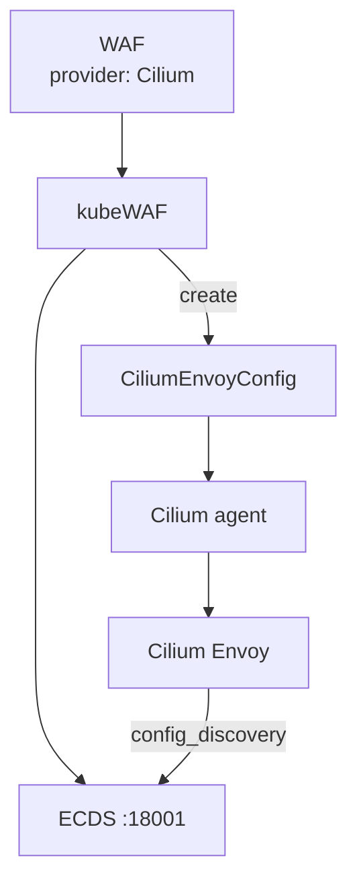
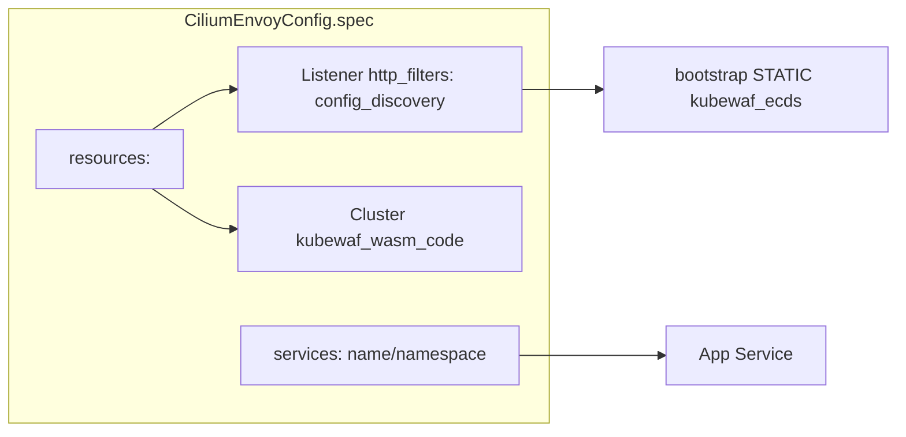

---

title: "Cilium"
description: "Protect traffic with kubeWAF and Cilium"
weight: 30
content_type: task
aliases:
  - "/docs/tasks/cilium/"
  - "/docs/operator/cilium/"
  - "/docs/kubewaf/operator/cilium/"
---
Use kubeWAF with **Cilium** L7 / Gateway API. The operator creates a
**CiliumEnvoyConfig (CEC)** with the same ECDS `config_discovery` stub as
Envoy Gateway and Istio, attached to a Kubernetes Service.

{}
Cilium ships a **minimal Envoy**. Wasm and ECDS availability depend on your
Cilium version and build options. kubeWAF always creates the CEC slot; full
request blocking requires a Cilium data plane that can load the filter.
{}


## How it works





## Prerequisites

- Cilium with Envoy / L7 proxy (and ideally Gateway API if you use Gateways)
- CRD `ciliumenvoyconfigs.cilium.io`
- kubeWAF operator with ECDS + wasm
- A **Service** to attach the CEC to (usually your app or gateway Service)
- **Bootstrap-static** `kubewaf_ecds` on `cilium-envoy` (see below)
- Optional: remesh `--otel-service` for STATIC `kubewaf_otel` + `stats_tags`.
  Cilium Envoy 1.19 does not load the OTel stats sink or a CEC access logger.
  Catalog OTLP and eval capture do not run — see
  [Capture](/docs/platform/observability/capture/#cilium).

## Bootstrap `kubewaf_ecds`

Cilium agent xDS does not serve ECDS. Envoy only accepts `ApiConfigSource` when
`kubewaf_ecds` is a **STATIC** cluster on the Envoy bootstrap (not in the CEC).
`cilium-envoy` is hostNetwork — use the kubeWAF ECDS Service **ClusterIP**, port
18001, not `*.svc.cluster.local`.

```bash
hack/scripts/merge-cilium-envoy-ecds-bootstrap.sh --apply --helm-upgrade \
  --ecds-namespace kubewaf-system --ecds-service kubewaf-ecds
```

That dumps Cilium’s generated bootstrap, adds the cluster, writes ConfigMap
`cilium-envoy-bootstrap-kubewaf`, and sets Cilium
`envoy.bootstrapConfigMap` using the **installed** Cilium chart version.
Keep `xds-grpc-cilium`. Helm-only steps (no git tree) are in the kubeWAF chart
NOTES and ConfigMap `*-cilium-envoy-ecds-fragment`.
If the ECDS ClusterIP changes, re-apply the merged ConfigMap **and** rollout
`ds/cilium-envoy`. If the ECDS Service is deleted, that ClusterIP can be reused —
revert the bootstrap CM on uninstall (see chart NOTES). ECDS is plaintext.

## Example

```yaml
apiVersion: waf.kubewaf.io/v1beta1
kind: WAF
metadata:
  name: shop-waf
  namespace: shop
spec:
  provider:
    type: Cilium
    cilium:
      serviceName: shop-frontend
      serviceNamespace: shop
  targetRef:
    group: gateway.networking.k8s.io
    kind: Gateway
    name: demo-gateway
  ruleRefs:
  - kind: RuleSet
    name: shop-rules
  crsEnable: false
  logLevel: 3
```

### Resulting object

```text
CiliumEnvoyConfig/kubewaf-shop-waf  (namespace shop)
```

Status:

| Field | Expected |
|-------|----------|
| `status.provider` | `Cilium` |
| `status.slotKind` | `CiliumEnvoyConfig` |
| `status.slotName` | `kubewaf-shop-waf` |

```bash
kubectl get cec -n shop
kubectl get ciliumenvoyconfig kubewaf-shop-waf -n shop -o yaml
```

## Capabilities matrix (practical)

| Capability | Typical status |
|------------|----------------|
| CEC created by kubeWAF | Always (`config_discovery` → `kubewaf_ecds`) |
| `kubewaf_ecds` on cilium-envoy bootstrap | Required (not a CEC cluster) |
| Wasm filter enforcement | Depends on Cilium Envoy build + bootstrap merge |
| Gateway API GatewayClass `cilium` | Optional; install Gateway API + enable Cilium Gateway |

## Debugging

1. **CEC not created** — RBAC for `cilium.io/ciliumenvoyconfigs`; operator logs
2. **Service not proxied** — wrong `cilium.serviceName` / namespace
3. **No blocking** — confirm bootstrap has STATIC `kubewaf_ecds` (ClusterIP);
   Envoy rejects CEC-defined ECDS clusters. Check operator ECDS subscribe logs.
4. **Experimental traffic e2e** — `E2E_CILIUM_TRAFFIC=true` in [e2e suite](https://github.com/kubewaf-io/kubewaf/blob/main/test/e2e/README.md)

## Related

- [Data plane (ECDS)](/docs/platform/dataplane-ecds/)
- [Architecture](/docs/get-started/architecture/)
- [Observability](/docs/platform/observability/)
- [Cilium Envoy docs](https://docs.cilium.io/en/stable/network/servicemesh/envoy/)
