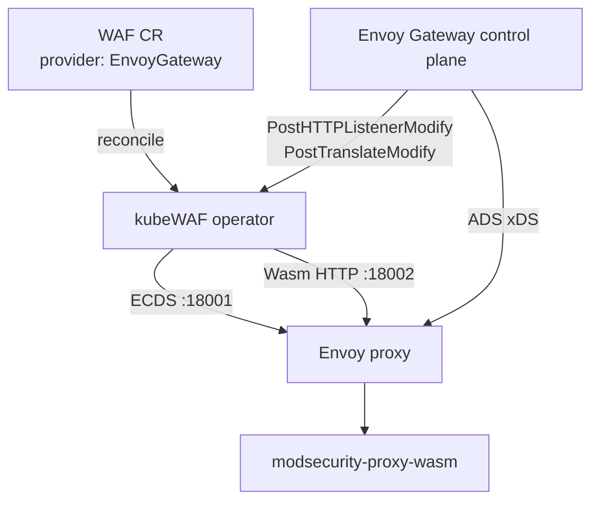
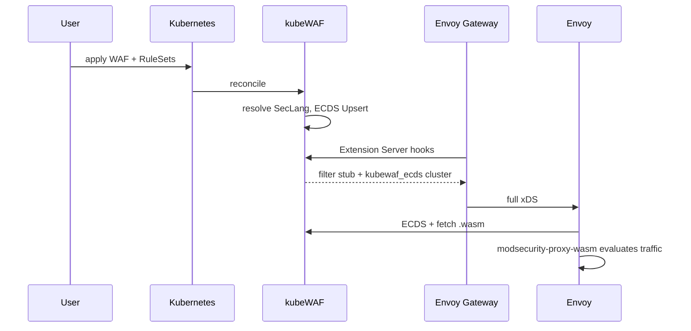

---

title: "Envoy Gateway"
description: "Protect traffic with kubeWAF and Envoy Gateway"
weight: 10
content_type: task
aliases:
  - "/docs/tasks/envoy-gateway/"
  - "/docs/operator/envoy-gateway/"
  - "/docs/kubewaf/operator/envoy-gateway/"
---
Protect Gateway API traffic when your cluster runs **Envoy Gateway**. kubeWAF:

1. Publishes **modsecurity-proxy-wasm** config over **gRPC ECDS**
2. Injects the filter slot via the **Envoy Gateway Extension Server**

For the full multi-provider model see [Data plane (ECDS)](/docs/platform/dataplane-ecds/).

## How it works





## Prerequisites

1. **Envoy Gateway** installed (e.g. GatewayClass `eg`)
2. **Gateway API** CRDs
3. kubeWAF operator with dataplane ports (Helm chart defaults)
4. **Wasm binaries** available on the operator under `/wasm/`
5. Envoy Gateway **extensionManager** pointing at kubeWAF (below)

### EnvoyGateway: inject kubeWAF

Envoy Gateway reads an **`EnvoyGateway`** document from ConfigMap
`envoy-gateway-config`. Without `extensionManager`, a `WAF` can be Ready
and never appear in Envoy xDS.

```yaml
# envoy-gateway-kubewaf.yaml
apiVersion: v1
kind: ConfigMap
metadata:
  name: envoy-gateway-config
  namespace: envoy-gateway-system
data:
  envoy-gateway.yaml: |
    apiVersion: gateway.envoyproxy.io/v1alpha1
    kind: EnvoyGateway
    gateway:
      controllerName: gateway.envoyproxy.io/gatewayclass-controller
    provider:
      type: Kubernetes
    extensionManager:
      policyResources:
        - group: waf.kubewaf.io
          version: v1beta1
          kind: WAF
      hooks:
        xdsTranslator:
          post:
            - HTTPListener
            - Translation
          translation:
            cluster:
              includeAll: true
            secret:
              includeAll: true
      service:
        fqdn:
          hostname: kubewaf-ecds.kubewaf-system.svc.cluster.local
          port: 5005
```

```bash
kubectl apply -f envoy-gateway-kubewaf.yaml
kubectl -n envoy-gateway-system rollout restart deployment/envoy-gateway
```

`HTTPListener` injects the Wasm filter stub. `Translation` plus
`translation.cluster.includeAll` merges the `kubewaf_ecds` cluster.
Hostname/port must match the kubeWAF Helm Service (`kubewaf-ecds:5005`).

First-time Helm install (same `EnvoyGateway` object under `config.envoyGateway`):

```bash
helm upgrade --install eg oci://docker.io/envoyproxy/gateway-helm \
  --version v1.8.0 \
  --namespace envoy-gateway-system \
  --create-namespace \
  -f envoy-gateway-values.yaml
```

```yaml
# envoy-gateway-values.yaml
config:
  envoyGateway:
    gateway:
      controllerName: gateway.envoyproxy.io/gatewayclass-controller
    provider:
      type: Kubernetes
    extensionManager:
      policyResources:
        - group: waf.kubewaf.io
          version: v1beta1
          kind: WAF
      hooks:
        xdsTranslator:
          post:
            - HTTPListener
            - Translation
          translation:
            cluster:
              includeAll: true
            secret:
              includeAll: true
      service:
        fqdn:
          hostname: kubewaf-ecds.kubewaf-system.svc.cluster.local
          port: 5005
```

Also grant the Envoy Gateway ServiceAccount permission to list/watch `wafs` (and optionally patch status):

```yaml
apiVersion: rbac.authorization.k8s.io/v1
kind: ClusterRole
metadata:
  name: kubewaf-envoy-gateway-waf-reader
rules:
  - apiGroups: [waf.kubewaf.io]
    resources: [wafs, wafs/status]
    verbs: [get, list, watch, update, patch]
---
apiVersion: rbac.authorization.k8s.io/v1
kind: ClusterRoleBinding
metadata:
  name: kubewaf-envoy-gateway-waf-reader
roleRef:
  apiGroup: rbac.authorization.k8s.io
  kind: ClusterRole
  name: kubewaf-envoy-gateway-waf-reader
subjects:
  - kind: ServiceAccount
    name: envoy-gateway
    namespace: envoy-gateway-system
```

### Bootstrap: static `kubewaf_ecds` cluster (required)

Envoy rejects ECDS filter stubs unless the gRPC cluster named in
`ApiConfigSource` is a **bootstrap static (non-EDS) cluster**. Adding
`kubewaf_ecds` only via CDS (`PostTranslateModify`) produces:

```text
Error adding/updating listener(s) ...:
ApiConfigSource must have a statically defined non-EDS cluster: 'kubewaf_ecds'
```

Patch the `EnvoyProxy` used by your GatewayClass (JSONPatch appends to the
default bootstrap):

```yaml
apiVersion: gateway.envoyproxy.io/v1alpha1
kind: EnvoyProxy
metadata:
  name: envoy-proxy-config
  namespace: envoy-gateway-system
spec:
  bootstrap:
    type: JSONPatch
    jsonPatches:
      - op: add
        path: /static_resources/clusters/-
        value:
          name: kubewaf_ecds
          type: STRICT_DNS
          connect_timeout: 2s
          lb_policy: ROUND_ROBIN
          typed_extension_protocol_options:
            envoy.extensions.upstreams.http.v3.HttpProtocolOptions:
              "@type": type.googleapis.com/envoy.extensions.upstreams.http.v3.HttpProtocolOptions
              explicit_http_config:
                http2_protocol_options: {}
          load_assignment:
            cluster_name: kubewaf_ecds
            endpoints:
              - lb_endpoints:
                  - endpoint:
                      address:
                        socket_address:
                          address: kubewaf-ecds.kubewaf-system.svc.cluster.local
                          port_value: 18001
```

Hostname/port must match the kubeWAF ECDS Service (`kubewaf-ecds` port **18001**).
Restart Envoy proxy pods after changing bootstrap.

## Basic example

Protect an entire Gateway:

```yaml
apiVersion: waf.kubewaf.io/v1beta1
kind: WAF
metadata:
  name: shop-waf
  namespace: shop
spec:
  provider:
    type: EnvoyGateway   # default if omitted (Auto → EnvoyGateway)
  targetRef:
    group: gateway.networking.k8s.io
    kind: Gateway
    name: external-gateway
  ruleRefs:
  - kind: RuleSet
    name: shop-rules
    namespace: shop
  crsEnable: false
  logLevel: 1
```

You may also target `HTTPRoute` (same namespace). Prefer **Gateway** targets so
the Extension Server can match listeners reliably.

## CRS + custom rules

```yaml
spec:
  crsEnable: false
  crs:
    paranoiaLevel: 2
    inboundAnomalyThreshold: 10
    removeById: [942100]
  ruleRefs:
  - kind: RuleSet
    name: baseline
    namespace: platform
  - kind: RuleSet
    name: shop-specific
    namespace: shop
```

Directive order (Path B): defaults → `spec.crs` setup → RuleSet SecLang → exclusions.
Path A (`crsEnable: true`, full-catalog wasm) inserts `Include @owasp_crs` before exclusions.

## Wasm binaries

| Setting | Role |
|---------|------|
| ModSecurity | `modsecurity-proxy-wasm` at `/wasm/modsecurity-proxy-wasm.wasm` |
| Envoy fetch | Operator wasm server on `:18002` |

## Observing status

```bash
kubectl get waf shop-waf -n shop -o yaml
```

Expect:

- `status.provider: EnvoyGateway`
- `status.slotKind: ExtensionServer`
- `status.ecdsResourceName: kubewaf/shop/shop-waf`
- `Ready=True`, `ReferencesResolved=True`

## Debugging

1. **Rules not applied**
   - `kubectl describe waf …` → conditions
   - Envoy Gateway logs: extension server errors
   - Envoy admin: filter chain contains `kubewaf/…`

2. **Wasm load failures**
   - Curl the operator wasm endpoint from a debug pod:
     `http://kubewaf-ecds.kubewaf-system.svc:18002/wasm/modsecurity-proxy-wasm.wasm`
   - Check `X-Checksum-Sha256` matches `status` / ECDS

3. **403 on every request**
   - Missing CRS init / thresholds — attach a Path B RuleSet and set `spec.crs` (Path A needs full-catalog wasm)

4. **Extension Server not called**
   - Confirm `extensionManager` hostname/port
   - NetworkPolicy must allow EG → operator:5005

## Common patterns

### Protect everything on a Gateway

One `WAF` targeting the `Gateway` — all attached HTTPRoutes inherit the filter.

### Per-route policies

Multiple `WAF` objects with more specific `targetRef` (HTTPRoute). Extension
Server injects all matching configs for the listener.

### Staging vs production

Different RuleSets (`staging-strict` vs `production-balanced`) referenced by
different WAF objects.

## Limitations

- Full HTTP support via Gateway API; TCP/TLS depends on EG Wasm capabilities
- Requires EG Extension Server privilege (platform-admin setup)
- Prefer top-level `targetRef` / `targetRefs` (Envoy Gateway policy attachment)

## Related

- [Data plane (ECDS)](/docs/platform/dataplane-ecds/)
- [Architecture](/docs/get-started/architecture/)
- [Observability](/docs/platform/observability/)
- [Envoy Gateway Wasm docs](https://gateway.envoyproxy.io)
