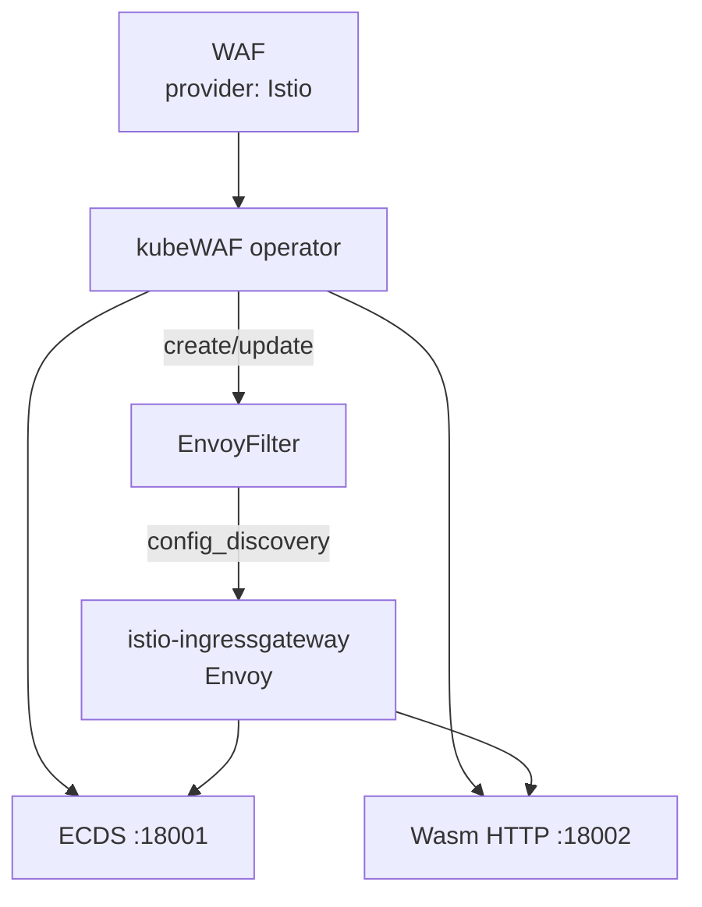
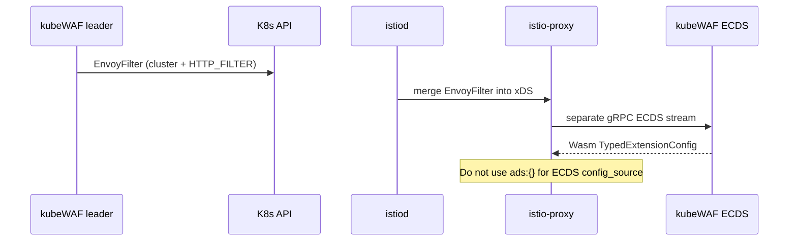

---

title: "Istio"
description: "Protect traffic with kubeWAF and Istio"
weight: 20
content_type: task
aliases:
  - "/docs/tasks/istio/"
  - "/docs/operator/istio/"
  - "/docs/kubewaf/operator/istio/"
---
Use kubeWAF with **Istio** ingress (or mesh) Envoys. The operator creates an
**EnvoyFilter** that installs an HTTP filter stub; **rules are served over
external ECDS** (not through istiod’s ADS).

## How it works





## Prerequisites

- Istio installed (sidecars and/or ingress gateway)
- `EnvoyFilter` CRD (`networking.istio.io`)
- kubeWAF operator with ECDS + wasm ports
- Wasm binary loaded on the operator

The EnvoyFilter slot uses **workload selectors**. You still must set
`targetRef` / `targetRefs` (webhook). The referenced Gateway API object is not
required for the Istio data path when `provider.type: Istio` is explicit.

## Example

```yaml
apiVersion: waf.kubewaf.io/v1beta1
kind: WAF
metadata:
  name: shop-waf
  namespace: shop
spec:
  provider:
    type: Istio
    istio:
      workloadSelector:
        istio: ingressgateway
      context: GATEWAY          # or SIDECAR_INBOUND, etc.
    # Optional: override ECDS Service DNS
    # ecdsService: kubewaf-ecds.kubewaf-system.svc.cluster.local:18001
  targetRef:
    group: gateway.networking.k8s.io
    kind: Gateway
    name: demo-gateway
  ruleRefs:
  - kind: RuleSet
    name: shop-rules
  crsEnable: false
  logLevel: 1
```

### What gets created

```text
EnvoyFilter/kubewaf-shop-waf  (same namespace as WAF)
```

Patches:

1. **CLUSTER** `kubewaf_ecds` → operator ECDS
2. **CLUSTER** `kubewaf_wasm_code` → operator wasm HTTP (`/wasm`)
3. **HTTP_FILTER** `INSERT_BEFORE` router with `config_discovery` named  
   `kubewaf/shop/shop-waf`

## Status

```bash
kubectl get waf shop-waf -o yaml
kubectl get envoyfilter -n shop
```

| Field | Expected |
|-------|----------|
| `status.provider` | `Istio` |
| `status.slotKind` | `EnvoyFilter` |
| `status.slotName` | `kubewaf-<waf-name>` |

## Debugging

1. **EnvoyFilter missing** — check operator RBAC for `networking.istio.io`
2. **Filter not in chain** — wrong `workloadSelector` / `context`
3. **ECDS connect fail** — NetworkPolicy / DNS for `ecdsService`
4. **Config empty on some pods** — scale operator ≥1 with dataplane sync (all replicas serve ECDS)

```bash
istioctl proxy-config listener -n istio-system deploy/istio-ingressgateway
istioctl proxy-config cluster  -n istio-system deploy/istio-ingressgateway | grep kubewaf
```

## Comparison with WasmPlugin

| Approach | Used by kubeWAF? | Rule updates |
|----------|------------------|--------------|
| **EnvoyFilter + external ECDS** | Yes | gRPC ECDS only |
| Istio `WasmPlugin` | No | — |

External ECDS keeps parity with Envoy Gateway: one config channel for all providers.

## Related

- [Data plane (ECDS)](/docs/platform/dataplane-ecds/)
- [Architecture](/docs/get-started/architecture/)
- [Istio EnvoyFilter](https://istio.io/latest)
