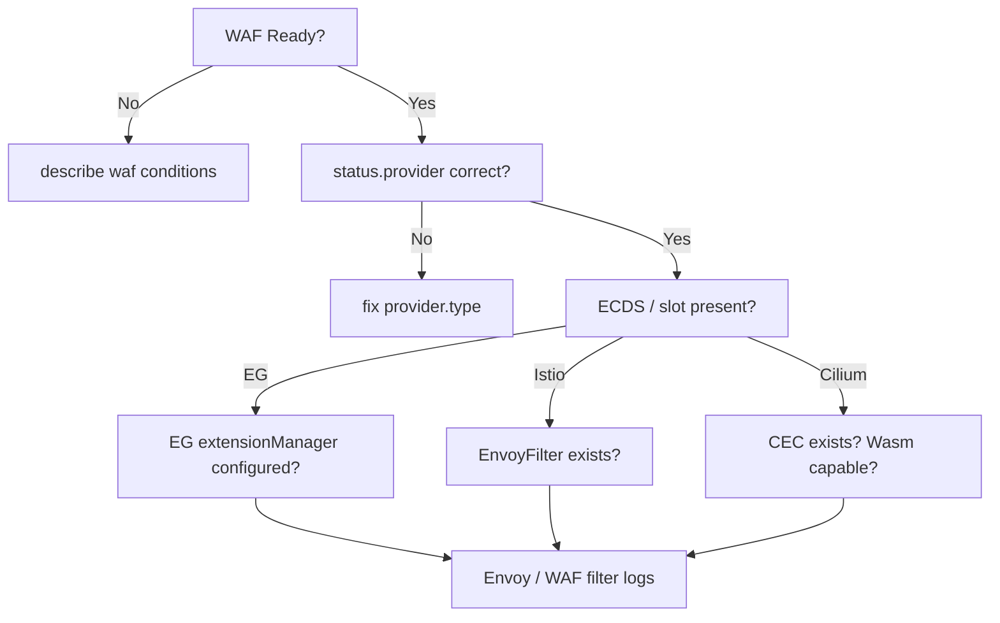

---

title: "Troubleshooting"
description: "Common issues and how to resolve them"
weight: 60
content_type: task
aliases:
  - "/docs/tasks/troubleshooting/"
  - "/docs/troubleshooting/"
  - "/docs/kubewaf/troubleshooting/"
---
Common issues and how to diagnose them.

## Installation problems

**CRDs not registered**

```bash
kubectl get crd | grep kubewaf
```

Expect at least: `secrules`, `secactions`, `secruleidpools`, `phraselists`, `iplists`, `rulesets`, `wafs`.

**Operator pod CrashLooping**

```bash
kubectl logs -n kubewaf-system -l app.kubernetes.io/name=kubewaf -f
```

Common causes:

- Missing RBAC (rare after correct Helm install)
- Missing `/wasm/modsecurity-proxy-wasm.wasm` on the operator — wasm serve returns 503
- Port conflicts on 18001 / 5005 / 18002

**Multi-replica not electing leader**

```bash
kubectl get lease -n kubewaf-system
```

Ensure `--leader-elect=true` and RBAC for `coordination.k8s.io/leases`.

## Rule not enforced



1. Check WAF status:

   ```bash
   kubectl describe waf <name> -n <ns>
   ```

   Look for `ReferencesResolved` and `Ready`.

2. Confirm ECDS identity:

   ```bash
   kubectl get waf <name> -n <ns> -o jsonpath='{.status.ecdsResourceName}{"\n"}{.status.slotKind}{"\n"}'
   ```

3. Provider-specific:

   | Provider | Check |
   |----------|--------|
   | Envoy Gateway | EG ConfigMap `extensionManager`; operator Service `:5005` |
   | Istio | `kubectl get envoyfilter -n <ns>` contains `config_discovery` |
   | Cilium | `kubectl get cec -n <ns>`; Cilium Envoy Wasm support |

4. Wasm modules reachable:

   ```bash
   # WAF engine
   curl -sI http://kubewaf-ecds.kubewaf-system.svc:18002/wasm/modsecurity-proxy-wasm.wasm
   # Challenge / PoW (if enabled)
   curl -sI http://kubewaf-ecds.kubewaf-system.svc:18002/wasm/challenge-proxy-wasm.wasm
   ```

   Expect `200`, `X-Checksum-Sha256`, and `X-Wasm-Module`.

5. Engine / challenge status:

   ```bash
   kubectl get waf <name> -n <ns> -o jsonpath='{.status.engine}{" challenge="}{.status.challengeEnabled}{" secret="}{.status.challengeSecretName}{"\n"}'
   ```

6. Raise WAF engine verbosity:

   ```yaml
   spec:
     logLevel: 7
   ```

   Then inspect Envoy proxy logs.

## ReferencesResolved = False

- Missing SecRule / RuleSet  
- `allowedRules` namespace policy  
- Reference cycle  
- Wrong `group` / `version` on RuleRef  

Message is on the condition. The operator does **not** publish a new ECDS
snapshot. Envoy keeps the last good config.

## PhraseListsResolved = False

- Custom `@pmFromFile` / `@ipMatchFromFile` basename has no Ready PhraseList/IPList
- `spec.phraseListPolicy: FailClosed` (default)

Set `IgnoreUnknown` only if you accept dropping those SecLang lines.

## Ready = False with ECDS errors

- modsecurity-proxy-wasm not loaded on the operator (`/wasm/modsecurity-proxy-wasm.wasm`)  
- Challenge enabled but challenge wasm missing, or managed Secret not created (`kubectl get secret <waf>-challenge-hmac`)
- Invalid HTTP URL / sha256 mismatch  
- ECDS snapshot reject — check operator logs for `ECDS upsert`

## 403 on every request

Usually CRS init / thresholds:

- Attach a Path B CRS RuleSet (`ruleset-api`, …), or Path A with full-catalog wasm  
- Set `spec.crs.inboundAnomalyThreshold` and paranoia explicitly  

## High latency / CPU

CRS at high paranoia is expensive.

- Lower `crs.paranoiaLevel`  
- Use exclusions (`removeById`, `updateTargetById`)  
- Split heavy RuleSets only onto sensitive routes  

## Multi-replica flapping / intermittent bypass

- All pods must run dataplane sync (built-in); verify every pod logs ECDS upserts  
- Service must select **all** operator pods  
- PDB / rolling update should keep at least one Ready pod  

## Envoy Gateway Extension Server errors

- Hostname/port must match operator Service  
- NetworkPolicy allowing EG → operator:5005  
- `policyResources` must include `waf.kubewaf.io/WAF`  
- EG logs: `extension` / hook errors  

## Istio EnvoyFilter present but no effect

- `workloadSelector` must match ingress pods (`istio: ingressgateway` etc.)  
- `context: GATEWAY` vs sidecar contexts  
- Confirm Envoy has a second xDS stream to `kubewaf_ecds` (not only istiod)  

## Cilium CEC present but no blocking

- CEC must contain `config_discovery` → `kubewaf_ecds` (not inline Wasm).
- `kubewaf_ecds` must be **STATIC** on the cilium-envoy bootstrap (ClusterIP of
  the kubeWAF ECDS Service). CEC-defined ECDS clusters are rejected.
- Confirm operator ECDS logs show a subscribe for the WAF filter name.
- Wasm still depends on the Cilium Envoy build.

## Collecting support info

```bash
kubectl get waf,ruleset,secrule -A -o yaml   # redact secrets
kubectl logs -n kubewaf-system -l app.kubernetes.io/name=kubewaf --tail=200
kubectl get envoyfilter,ciliumenvoyconfig -A
# Envoy Gateway:
kubectl -n envoy-gateway-system logs deploy/envoy-gateway --tail=100
```

## Related docs

- [Architecture](/docs/get-started/architecture/)
- [Data plane](/docs/platform/dataplane-ecds/)
- [Envoy Gateway](/docs/platform/providers/envoy-gateway/) · [Istio](/docs/platform/providers/istio/) · [Cilium](/docs/platform/providers/cilium/)
- [Challenge](/docs/users/challenge/) · [Engine](/docs/platform/engine/)
- [Webhooks](/docs/platform/webhooks/) · [Probes](/docs/platform/observability/probes/)
