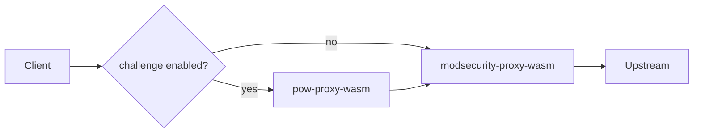

---

title: "Proof-of-Work challenge"
description: "Enable and configure the optional PoW challenge filter on a WAF resource"
weight: 40
content_type: task
aliases:
  - "/docs/tasks/challenge/"
  - "/docs/kubewaf/operator/challenge/"
---
kubeWAF can install an optional **browser proof-of-work (PoW) challenge** filter
**in front of** the WAF engine. Clients without a valid clearance cookie must
solve a short CPU challenge before their traffic is evaluated by ModSecurity.

This page covers **only what you configure on the `WAF` CR**. For the filter’s
internal design (cookies, crypto, standalone Envoy), see the separate
[pow-proxy-wasm](/engines/pow-proxy-wasm/) project docs.



---

## When to enable it

| Use case | Fit |
|----------|-----|
| Cheap bots / scrapers without a full JS runtime | Strong |
| Absorb bursty unauthenticated traffic before expensive WAF rules | Strong |
| “Pay with CPU” gate next to rate limiting | Strong |
| Hard identity / account takeover | Weak — use auth |
| True one-time tokens with cluster-wide shared state | Not this design |

Place challenge **after** coarse rate limiting and **before** WAF / auth filters
(the operator installs it immediately before the WAF filter in the chain).

---

## Enable on a WAF

```yaml
apiVersion: waf.kubewaf.io/v1beta1
kind: WAF
metadata:
  name: shop-waf
  namespace: shop
spec:
  provider:
    type: EnvoyGateway
  targetRef:
    group: gateway.networking.k8s.io
    kind: Gateway
    name: external
  ruleRefs:
  - kind: RuleSet
    name: shop-rules

  challenge:
    enabled: true
    # HMAC is auto-managed — no secret required for the default path
    baseDifficulty: 18
    minDifficulty: 12
    maxDifficulty: 26
    header: x-challenge-passed
    headerValue: "1"
```

When `spec.challenge` is present and enabled, the operator:

1. Resolves (or creates) the HMAC Secret  
2. Publishes a second ECDS resource for the challenge filter  
3. Inserts the challenge filter **before** the WAF filter in the provider slot  

---

## `spec.challenge` properties

| Field | Type | Default | Description |
|-------|------|---------|-------------|
| `enabled` | `bool` | `true` when the block is present | Install the challenge filter when `true` |
| `secret` | `string` | empty | Optional **plaintext** HMAC override (≥ 32 bytes). Dev / break-glass only |
| `secretRef` | `{ name, key }` | empty | Use an existing Secret in the **same namespace** as the WAF |
| `baseDifficulty` | `int` (1–32) | `18` | Default PoW difficulty (leading zero bits in SHA-256) |
| `minDifficulty` | `int` (1–32) | (filter default 12) | Lower bound for adaptive difficulty |
| `maxDifficulty` | `int` (1–32) | (filter default 26) | Upper bound for adaptive difficulty |
| `header` | `string` | empty | Optional response header name injected after a successful pass |
| `headerValue` | `string` | empty | Value for `header` |

### Difficulty intuition

Higher `baseDifficulty` means more client CPU before the first request succeeds.
Rough order of magnitude (device-dependent):

| `baseDifficulty` | Expected SHA-256 tries |
|------------------|-------------------------|
| 12 | ~4k (light) |
| 18 | ~260k (default) |
| 22 | ~4M |
| 26 | ~67M (heavy) |

Tune under real traffic; pair with rate limits for bots that never solve.

---

## HMAC secret management

The challenge filter needs a shared HMAC secret on **every** Envoy replica.

| Mode | How |
|------|-----|
| **Default (recommended)** | Operator creates Secret `<waf-name>-challenge-hmac` in the WAF namespace, key `hmac` (32 random bytes, base64url). Owned by the WAF; stable across reconciles so clearance cookies keep working |
| **SecretRef** | `secretRef: { name: my-hmac, key: hmac }` — bring your own Secret |
| **Inline** | `secret: "…"` — plaintext in the CR (≥ 32 bytes; avoid in production) |

Priority: inline `secret` → `secretRef` → managed Secret.

```yaml
# Bring your own Secret
spec:
  challenge:
    enabled: true
    secretRef:
      name: shop-challenge-hmac
      key: hmac
```

Rotate a **managed** secret by deleting it and letting the controller recreate it
(existing browser clearances will invalidate).

---

## Status fields

```bash
kubectl get waf shop-waf -n shop -o jsonpath='{.status.challengeEnabled}{" "}{.status.challengeSecretName}{"\n"}'
# true shop-waf-challenge-hmac
```

| Status field | Meaning |
|--------------|---------|
| `challengeEnabled` | Challenge filter is installed for this WAF |
| `challengeSecretName` | Secret name used for HMAC (managed or `secretRef` name) |

Also check overall WAF conditions (`Ready`, `ReferencesResolved`) as usual.

---

## What the operator wires

| Piece | Value |
|-------|--------|
| ECDS name (challenge) | `kubewaf/<namespace>/<waf-name>/challenge` |
| ECDS name (WAF) | `kubewaf/<namespace>/<waf-name>` |
| Default wasm path | `GET /wasm/challenge-proxy-wasm.wasm` on the operator wasm server |

You normally do **not** set raw plugin JSON — the controller maps CR fields + the
resolved HMAC into the filter config.

The challenge Wasm binary is served from the operator at
`/wasm/challenge-proxy-wasm.wasm` (also under `KO_DATA_PATH/wasm` in ko images).

---

## Minimal examples

### Challenge + CRS

```yaml
spec:
  crsEnable: false
  challenge:
    enabled: true
    baseDifficulty: 16
  ruleRefs:
  - kind: RuleSet
    name: app-rules
```

### Disable without removing the block

```yaml
spec:
  challenge:
    enabled: false
```

---

## Troubleshooting (operator view)

| Symptom | What to check |
|---------|----------------|
| `challengeEnabled=false` but you expected true | `spec.challenge` missing or `enabled: false` |
| Filter never loads | Operator serves `/wasm/challenge-proxy-wasm.wasm`; check ECDS status |
| Always challenge page in browser | Cookies blocked; clock skew; see [pow-proxy-wasm troubleshooting](/engines/pow-proxy-wasm/troubleshooting/) |
| Clearance works then fails after ~30 min | Expected clearance lifetime — re-solve |
| Wrong Secret | `status.challengeSecretName`; Secret exists and is ≥ 32 bytes when BYO |

General data-plane checks: [Troubleshooting](/docs/platform/troubleshooting/),
[Data plane (ECDS)](/docs/platform/dataplane-ecds/).

---

## Related

- [WAF CRD reference](/docs/reference/crds/waf/) — full field list  
- [WAF engine](/docs/platform/engine/) — ModSecurity wasm and CRS  
- [pow-proxy-wasm](/engines/pow-proxy-wasm/) — filter internals, standalone Envoy, security model  
