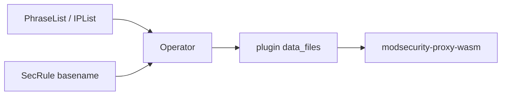

Custom SecLang rules often need **external list files**: scanner User-Agents
(`@pmFromFile`) or client IP blocklists (`@ipMatchFromFile`). In kubeWAF those
bodies are Kubernetes resources — not hand-mounted files on Envoy.

| Resource | Operator | Content |
|----------|----------|---------|
| [**PhraseList**](/docs/reference/crds/phraselist/) | `@pmFromFile` / `@pmf` | Phrase tokens (one per line) |
| [**IPList**](/docs/reference/crds/iplist/) | `@ipMatchFromFile` / `@ipMatchF` | IPs and CIDRs (one per line) |

Stock OWASP CRS `*.data` files remain **embedded** (operator pack + wasm). You
only create PhraseList/IPList for **custom** basenames (or intentional CRS overrides).

{}
List injection into plugin `data_files` is **always
enabled** for the WAF engine
on the dataplane path.
{}

## End-to-end flow



1. Create a **PhraseList** or **IPList** with `spec.fileName` ending in `.data`.
2. Write a **SecRule** whose operator value equals that basename.
3. Package the SecRule in a **RuleSet** (optional `phraseListRefs` / `ipListRefs`).
4. Attach the RuleSet from a **WAF** with the product WAF in the **same namespace**.
5. Operator resolves Ready lists → injects `data_files` → publishes ECDS.

## PhraseList example

```yaml
apiVersion: seclang.kubewaf.io/v1beta1
kind: PhraseList
metadata:
  name: team-scanners
  namespace: shop
spec:
  fileName: team-scanners.data
  content: |
    evil-scanner-bot
    internal-recon-tool
---
apiVersion: seclang.kubewaf.io/v1beta1
kind: SecRule
metadata:
  name: block-team-scanners
  namespace: shop
  labels:
    app: shop-waf
spec:
  match:
    - collections:
        - name: REQUEST_HEADERS
          arguments: [User-Agent]
      operator:
        name: pmFromFile
        value: team-scanners.data
  metadata:
    id: 100001
    phase: "1"
    message: Team scanner UA
  actions:
    disruptive:
      disruptiveActionType: deny
```

## IPList example

```yaml
apiVersion: seclang.kubewaf.io/v1beta1
kind: IPList
metadata:
  name: edge-ip-blocklist
  namespace: shop
spec:
  fileName: edge-ip-blocklist.data
  content: |
    203.0.113.0/24
    198.51.100.50
---
apiVersion: seclang.kubewaf.io/v1beta1
kind: SecRule
metadata:
  name: block-edge-ips
  namespace: shop
  labels:
    app: shop-waf
spec:
  match:
    - collections:
        - name: REMOTE_ADDR
      operator:
        name: ipMatchFromFile
        value: edge-ip-blocklist.data
  metadata:
    id: 100002
    phase: "1"
    message: Edge IP blocklist
  actions:
    disruptive:
      disruptiveActionType: deny
```

## Large lists (ConfigMap)

For bodies larger than comfortable inline YAML, use a ConfigMap in the same
namespace:

```yaml
spec:
  fileName: big-blocklist.data
  configMapRef:
    name: big-blocklist
    key: entries.txt
```

Or compose multiple keys with `parts` (in order; total ≤ 2 MiB).

## Packaging refs on RuleSet

Optional **presence checks** so a RuleSet fails early if a named list is missing
or not Ready. Refs do **not** inject unused files — only basenames that appear
in assembled SecLang are injected (budget-friendly).

```yaml
apiVersion: waf.kubewaf.io/v1beta1
kind: RuleSet
metadata:
  name: shop-rules
spec:
  ruleRefs:
    - kind: SecRule
      selector:
        matchLabels:
          app: shop-waf
  phraseListRefs:
    - name: team-scanners
  ipListRefs:
    - name: edge-ip-blocklist
```

## WAF policy for missing lists

When SecLang references a custom basename with no Ready PhraseList/IPList:

| `spec.phraseListPolicy` | Behavior |
|-------------------------|----------|
| `FailClosed` (default) | Refuse ECDS publish; WAF not Ready |
| `IgnoreUnknown` | Drop those SecLang lines and publish the rest |

```yaml
spec:
  phraseListPolicy: FailClosed
```

Stock CRS basenames are always filled from the operator CRS pack (unless a
PhraseList override is admitted with `seclang.kubewaf.io/allow-crs-override=true`).

## Verify

```bash
kubectl get phraselist,iplist -n shop
kubectl get secrule -n shop   # Ready after operator SecLang validation
kubectl get waf shop-waf -n shop \
  -o jsonpath='{.status.dataFilesCount} {.status.conditions[?(@.type=="PhraseListsResolved")]}{"\n"}'
```

Status highlights:

- `status.dataFilesCount` / `dataFilesRawBytes` — injected files
- Condition `PhraseListsResolved` — discovery outcome

## Constraints (v1)

- Same namespace as the WAF only
- One Ready owner per `(namespace, fileName)` across PhraseList **and** IPList
- Max composed body **2 MiB** per list / per WAF inject raw total
- Labels `seclang.kubewaf.io/phrase-list` / `ip-list` are optional convenience markers

## Related

- [PhraseList CRD](/docs/reference/crds/phraselist/)
- [IPList CRD](/docs/reference/crds/iplist/)
- [Writing security rules](/docs/security/writing-rules/)
- [Using RuleSets](/docs/users/rulesets/)
- [WAF CRD](/docs/reference/crds/waf/)
