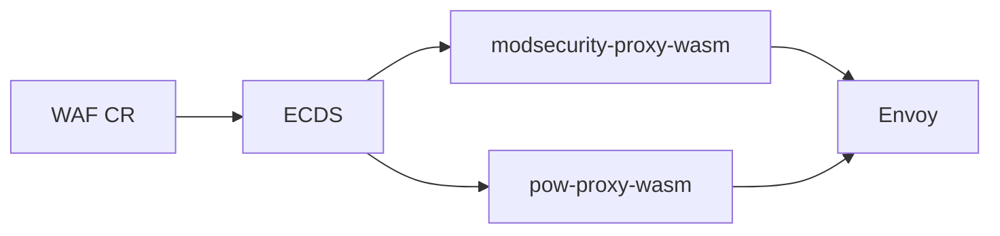

This is the **engines documentation root** — separate from the
[kubeWAF operator docs](/docs/home/).

Engines are Proxy-Wasm filters that run inside Envoy. kubeWAF deploys and configures them via
ECDS; you can also run them **standalone** without the operator.

  

    

      <h2 class="h4 card-title">modsecurity-proxy-wasm</h2>
      

        ModSecurity-compatible WAF engine with embedded OWASP CRS. Evaluates SecLang rules
        on request and response traffic.
      

      <ul class="small">
        <li><a href="/engines/modsecurity-proxy-wasm/">Overview</a></li>
        <li><a href="/engines/modsecurity-proxy-wasm/configuration/">Configuration</a></li>
        <li><a href="/engines/modsecurity-proxy-wasm/standalone/">Standalone Envoy</a></li>
      </ul>
      

        <a class="btn btn-sm btn-primary" href="/engines/modsecurity-proxy-wasm/">Open docs</a>
        <a class="btn btn-sm btn-outline-secondary" href="https://github.com/kubewaf-io/modsecurity-proxy-wasm">GitHub</a>
      

    

  

  

    

      <h2 class="h4 card-title">pow-proxy-wasm</h2>
      

        Stateless browser proof-of-work challenge filter. Optionally runs in front of the WAF
        engine to absorb bots before rule evaluation.
      

      <ul class="small">
        <li><a href="/engines/pow-proxy-wasm/">Overview</a></li>
        <li><a href="/engines/pow-proxy-wasm/arc42/">Architecture (arc42)</a></li>
        <li><a href="/engines/pow-proxy-wasm/how-it-works/">How it works</a></li>
        <li><a href="/engines/pow-proxy-wasm/configuration/">Configuration</a></li>
      </ul>
      

        <a class="btn btn-sm btn-primary" href="/engines/pow-proxy-wasm/">Open docs</a>
        <a class="btn btn-sm btn-outline-secondary" href="https://github.com/kubewaf-io/pow-proxy-wasm">GitHub</a>
      

    

  

## How engines relate to kubeWAF

| Concern | Where to look |
|---------|----------------|
| CRDs, RuleSets, providers, Helm install | [kubeWAF docs](/docs/home/) |
| Wasm JSON config, standalone Envoy, engine metrics | **This engines root** |
| Challenge on a `WAF` resource | [Tasks: Proof-of-work challenge](/docs/users/challenge/) |
| WAF engine (ModSecurity) | [Tasks: WAF engine](/docs/platform/engine/) |
