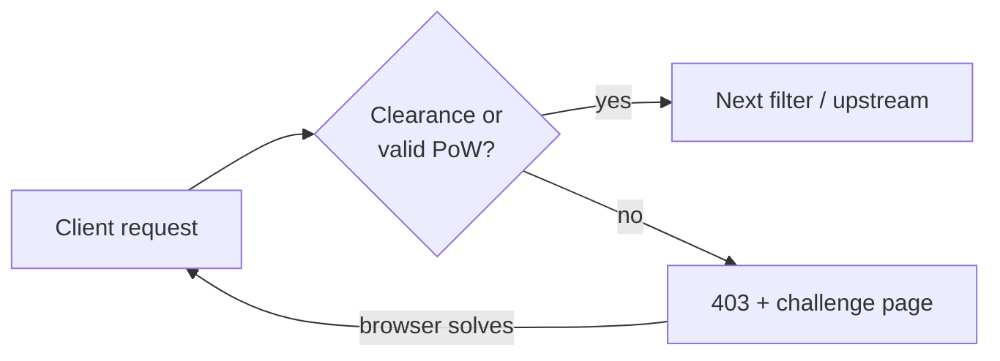

**pow-proxy-wasm** is a lightweight, **stateless** browser **Proof-of-Work (PoW)**
filter for Envoy and Envoy-based data planes.

**Status:** Alpha — packaging name and artifact are **pow-proxy-wasm**
(`pow-proxy-wasm.wasm`, `ghcr.io/kubewaf-io/pow-proxy-wasm`).

| | |
|--|--|
| **Repository** | [github.com/kubewaf-io/pow-proxy-wasm](https://github.com/kubewaf-io/pow-proxy-wasm) |
| **Language** | Go (`proxy-wasm-go-sdk`, `GOOS=wasip1`, Go **1.24.x** for Envoy builds) |
| **Artifact** | `pow-proxy-wasm.wasm` |
| **Architecture** | **[arc42 documentation](/engines/pow-proxy-wasm/arc42/)** |

This is a **standalone documentation root** for the challenge filter.

- **Enabling challenge on a kubeWAF `WAF` resource?** Use the
  [kubeWAF challenge guide](/docs/users/challenge/) (`spec.challenge` properties).
- **Filter internals / standalone Envoy?** Stay in this tree.
- **Full architecture (arc42)?** Use the [Architecture section](/engines/pow-proxy-wasm/arc42/).

## Pages in this root

- **[Architecture (arc42)](/engines/pow-proxy-wasm/arc42/)** — Goals, context, building blocks, runtime, deployment, ADRs, risks, glossary.
- **[How it works](/engines/pow-proxy-wasm/how-it-works/)** — Request path, cookies, crypto, IP binding, dynamic difficulty.
- **[Configuration](/engines/pow-proxy-wasm/configuration/)** — Raw plugin JSON fields for Envoy.
- **[Standalone Envoy](/engines/pow-proxy-wasm/standalone/)** — Build, docker-compose example, layout.
- **[Troubleshooting](/engines/pow-proxy-wasm/troubleshooting/)** — Common failure modes for the filter itself.

