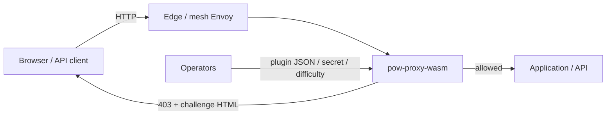
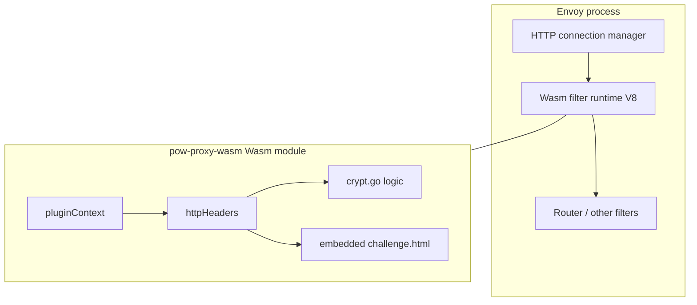

## 3.1 Business context

| Neighbour | Interface | Direction |
|-----------|-----------|-----------|
| Browser | Cookies + HTML page | Bidirectional |
| Non-browser client | `challenge-token` header | Client → filter |
| Envoy host | Proxy-WASM ABI (headers, properties, local response, tick) | Bidirectional |
| Upstream / next filter | Continues only if filter returns continue | Filter → host |
| Operator / kubeWAF | Configuration JSON (secret, difficulty, …) | Config → plugin |

### Business value

Raise the cost of automated scraping and cheap bots at L7 **without** application changes and **without** centralized session state.

## 3.2 Technical context

### External technical interfaces

| Interface | Technology | Notes |
|-----------|------------|-------|
| Plugin config | JSON string in Envoy Wasm `configuration` | Parsed at `OnPluginStart` |
| Request headers / cookies | HTTP | Cookie parse; optional `challenge-token`, `x-challenge-difficulty` |
| Response | Local 403 + body **or** pass-through | `SendHttpResponse` vs `ActionContinue` |
| Downstream identity | Envoy properties + optional XFF / X-Real-IP | See binding rules |
| Shared data | Proxy-WASM shared KV | Dynamic difficulty publish only |

## 3.3 Scope boundaries

**In scope:** challenge issue, PoW verify, clearance mint/verify, optional header inject, adaptive difficulty heuristics, standalone Envoy example, CI/tests.

**Out of scope:** secret distribution (K8s secrets / operator), TLS termination policy, rate-limit algorithms, WAF rules (see modsecurity-proxy-wasm), UI branding beyond the embedded page.
