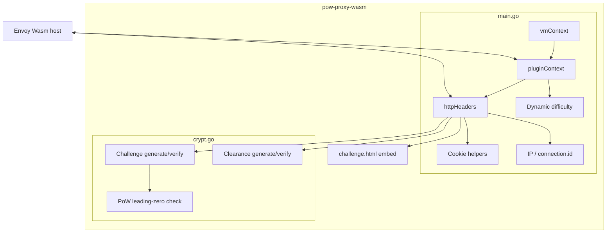

## 5.1 Whitebox overall system

## 5.2 Level 1 building blocks

| Block | Responsibility | Interfaces |
|-------|----------------|------------|
| **vmContext** | Register plugin factory | Proxy-WASM VM API |
| **pluginContext** | Config, secret, HMAC instance, difficulty state, tick | `OnPluginStart`, `OnTick`, `NewHttpContext` |
| **httpHeaders** | Per-request decision tree | `OnHttpRequestHeaders`, `OnHttpResponseHeaders` |
| **crypt package functions** | Portable crypto | Pure Go functions (also unit-tested) |
| **challenge.html** | Browser PoW UI | Cookies + navigation |

## 5.3 Important files (repository)

| Path | Role |
|------|------|
| `main.go` | Filter lifecycle, cookies, IP, difficulty |
| `crypt.go` | HMAC challenge/clearance, PoW verify |
| `challenge.html` | Client solver |
| `test/tools/powcli` | Offline mint/solve helper |
| `example/envoy` | Manual docker-compose demo |
| `test/fixtures`, `test/integration`, `test/perf` | Automated quality gates |

## 5.4 Blackbox crypt API (conceptual)

| Operation | Input | Output |
|-----------|-------|--------|
| Generate challenge | secret, difficulty, client context | `{c, s}` base64url pair |
| Verify solution | secret, `{c,s,n}`, expected context | ok / typed error |
| Generate clearance | secret, IP | `body.sig` cookie value |
| Verify clearance | secret, token, expected IP | ok / typed error |

## 5.5 Plugin configuration schema (blackbox)

See also [Configuration](../../configuration/).

| Field | Type | Required |
|-------|------|----------|
| `secret` | string ≥ 32 | yes |
| `base_difficulty` | uint | no (18) |
| `min_difficulty` | uint | no (12) |
| `max_difficulty` | uint | no (26) |
| `header` / `value` | string | no |
| `client_ip_source` | `auto` \| `source_address` | no (`auto`) |
