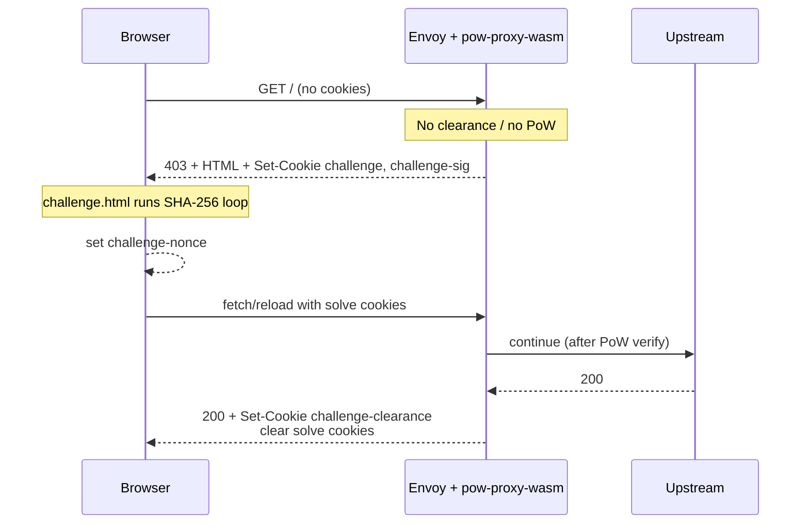
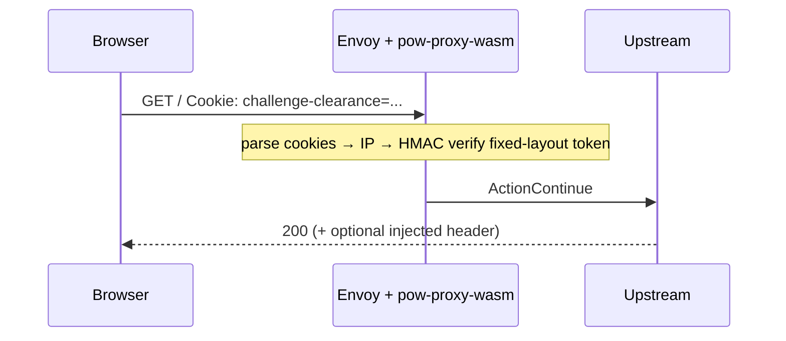

## 6.1 Scenario: first visit (issue challenge)

## 6.2 Scenario: return visit (clearance hot path)

## 6.3 Decision tree (`OnHttpRequestHeaders`)

1. Parse all challenge-related cookies in one pass.  
2. **If clearance present and valid** → continue (IP only).  
3. Build full client context (IP + connection.id).  
4. **If solve cookies / token valid** → continue; mark `issueClearance`.  
5. **Else** → generate challenge, local 403 + HTML, pause.

## 6.4 Response path after PoW

When `issueClearance` is set, `OnHttpResponseHeaders`:

1. Mint fixed-layout clearance for `ClearanceBind()` (IP).  
2. Set `challenge-clearance` (HttpOnly, 30 min).  
3. Clear `challenge`, `challenge-sig`, `challenge-nonce`.  
4. Optionally inject configured response header.

## 6.5 Dynamic difficulty tick

Every **5 seconds** (`OnTick`):

1. Read and zero local `challengeCounter`.  
2. Map recent issue count → difficulty bump over base.  
3. Clamp to min/max; store `currentDiff`.  
4. Publish to shared data key `challenge:current_difficulty`.

Request path prefers local `currentDiff` to avoid shared-data hostcalls.

## 6.6 Failure scenarios

| Case | Runtime behaviour |
|------|-------------------|
| Bad / expired clearance | Fall through → may re-challenge |
| Bad PoW / signature | Fall through → re-challenge |
| Missing secret at start | Plugin start fails (Envoy config error) |
| RNG failure on generate | Fail open: continue without challenge |
