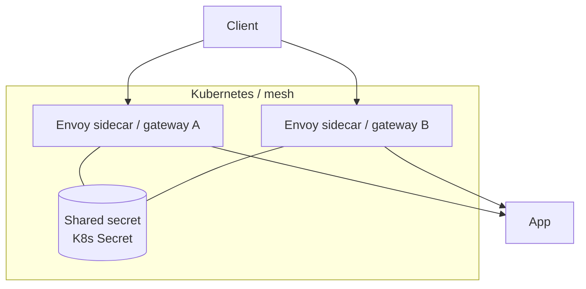
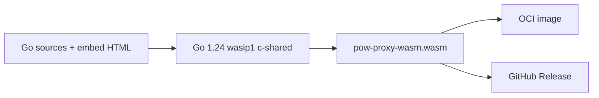

## 7.1 Infrastructure options

### A. Standalone Envoy

- Build `pow-proxy-wasm.wasm` (`make build`, Go **1.24.x**).  
- Mount as local file in Envoy Wasm filter `vm_config.code.local.filename`.  
- Provide plugin JSON with shared `secret`.  
- See [Standalone Envoy](../../standalone/) and the repo `example/envoy/`.

### B. kubeWAF operator

- User sets `spec.challenge` on the `WAF` CR.  
- Controller injects HMAC secret and maps difficulty fields into the Wasm filter config.  
- See [kubeWAF PoW challenge task](/docs/users/challenge/).

### C. OCI image

- Image contains `/plugin.wasm` (scratch base).  
- Registry: `ghcr.io/kubewaf-io/pow-proxy-wasm:<tag>`.  
- Pre-release tags (alpha/beta/rc) do **not** update `:latest`.

## 7.2 Deployment diagram (mesh)

All Envoy instances **must** share the same HMAC secret and compatible difficulty bounds.

## 7.3 Build pipeline

## 7.4 Environment requirements

| Component | Requirement |
|-----------|-------------|
| Envoy | Wasm V8 runtime; filter config supports Proxy-WASM |
| Go (rebuild) | **1.24.x** for Envoy-compatible wasip1 |
| Secret storage | Operator-managed; never commit production secrets |
| Clocks | Reasonable NTP; challenge window is 60 s |

## 7.5 Placement recommendation

- After **rate limiting**, before **WAF / auth** filters.  
- Prefer edge placement if using `client_ip_source: source_address`.  
- Ensure trusted hop count / XFF stripping if using `auto` IP mode.  
