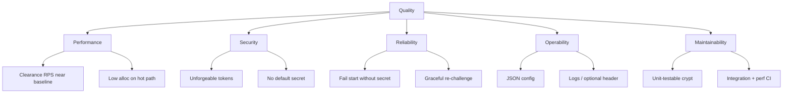

## 10.1 Quality tree

## 10.2 Quality scenarios

| ID | Scenario | Expected response | Measure |
|----|----------|-------------------|---------|
| QS-1 | Valid clearance under load | Continue with low added latency | k6 clearance vs baseline |
| QS-2 | No cookies | 403 + solver page | bats / manual |
| QS-3 | Valid PoW cookies | 200 + clearance issued | bats |
| QS-4 | Wrong HMAC secret on one replica | Failures / re-challenge | operational test |
| QS-5 | Missing secret in config | Plugin does not start | Envoy logs |
| QS-6 | Difficulty override header | Payload `diff` reflects clamp | bats |
| QS-7 | Go 1.26 Wasm build | Must not be used on Envoy today | policy / CI pin 1.24 |

## 10.3 Performance targets (directional, not SLOs)

From CI-like smoke (16 VUs, 30 s) after hot-path work:

| Path | Order of magnitude |
|------|--------------------|
| Baseline (no Wasm filter) | ~8k RPS |
| Valid clearance | ~6.4k RPS (~−20% vs baseline) |
| Challenge issue (403) | Much lower RPS (CPU + HTML) |

Treat as **engineering benchmarks**, not production guarantees.

## 10.4 Test strategy

| Layer | What | Command / location |
|-------|------|--------------------|
| Unit | Crypto, cookies, difficulty clamps | `make test-unit` |
| Bench | Micro-benchmarks | `make test-bench` |
| Integration | Envoy + V8 full flow | `make test-bats` |
| Perf | k6 baseline vs clearance | `make test-perf-k6-compare` |
| CI | All of the above | `.github/workflows/test.yml` |

## 10.5 Compatibility

| Dimension | Requirement |
|-----------|-------------|
| Envoy | Wasm V8; Proxy-WASM HTTP filter |
| Go rebuild | 1.24.x |
| Browsers | Modern JS; cookies enabled; no third-party cookie dependency for first-party host |
