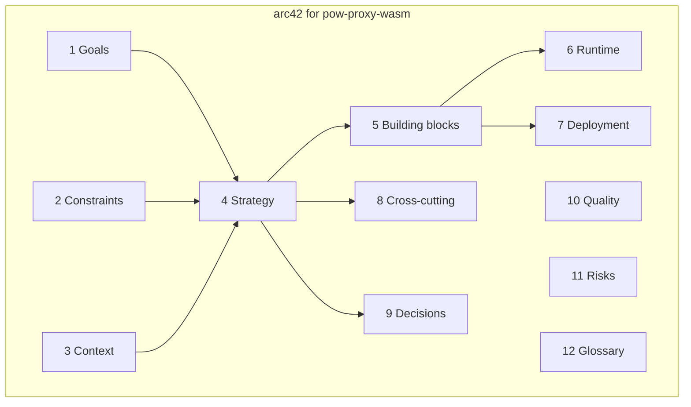

This tree is the **[arc42](https://arc42.org/)** architecture documentation for
**[pow-proxy-wasm](https://github.com/kubewaf-io/pow-proxy-wasm)** — a Go Proxy-WASM
filter that implements a **stateless browser Proof-of-Work challenge** for Envoy
and Envoy-based meshes (including kubeWAF).

**Status:** Alpha. Config, token formats, and APIs may still change.

| | |
|--|--|
| **Repository** | [github.com/kubewaf-io/pow-proxy-wasm](https://github.com/kubewaf-io/pow-proxy-wasm) |
| **Language** | Go (`proxy-wasm-go-sdk`, `GOOS=wasip1`) |
| **Artifact** | `pow-proxy-wasm.wasm` · OCI `ghcr.io/kubewaf-io/pow-proxy-wasm` |
| **License** | Apache-2.0 |

## Sections

| # | Document |
|---|----------|
| 1 | [Introduction and goals](01-introduction-and-goals/) |
| 2 | [Constraints](02-constraints/) |
| 3 | [Context and scope](03-context-and-scope/) |
| 4 | [Solution strategy](04-solution-strategy/) |
| 5 | [Building block view](05-building-block-view/) |
| 6 | [Runtime view](06-runtime-view/) |
| 7 | [Deployment view](07-deployment-view/) |
| 8 | [Cross-cutting concepts](08-crosscutting-concepts/) |
| 9 | [Architecture decisions](09-architecture-decisions/) |
| 10 | [Quality requirements](10-quality-requirements/) |
| 11 | [Risks and technical debt](11-risks-and-technical-debt/) |
| 12 | [Glossary](12-glossary/) |

## Related docs (this engine)

- [How it works](../how-it-works/) — shorter operational overview  
- [Configuration](../configuration/) — plugin JSON  
- [Standalone Envoy](../standalone/) — local demo  
- [Troubleshooting](../troubleshooting/)  
- [kubeWAF challenge task](/docs/users/challenge/) — operator `spec.challenge`

